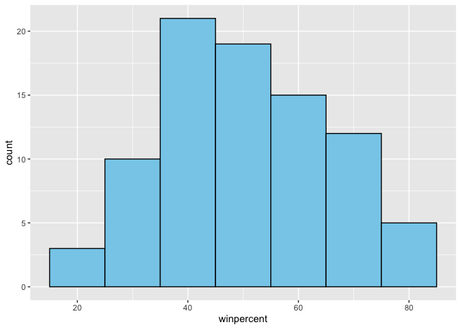
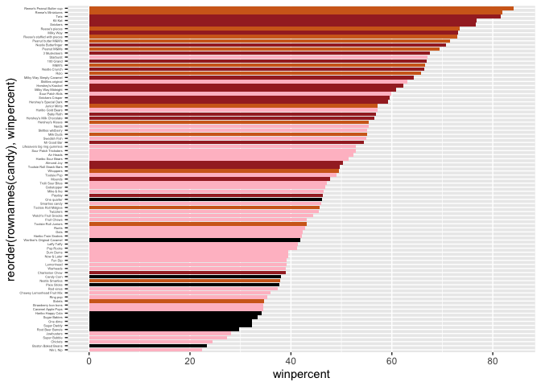
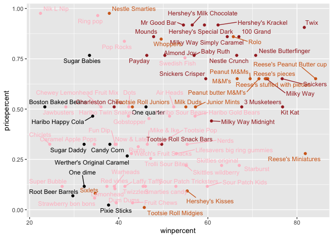
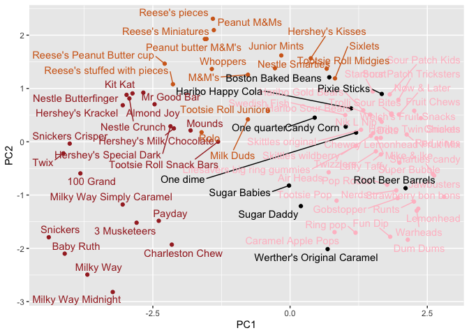
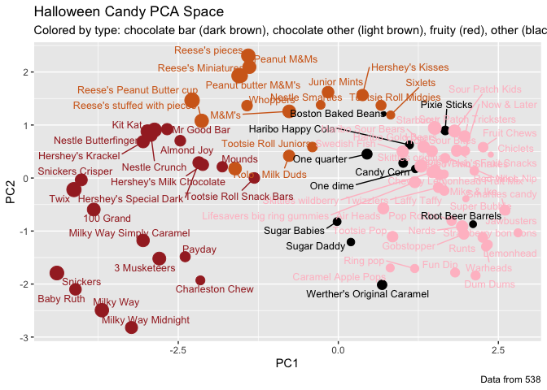
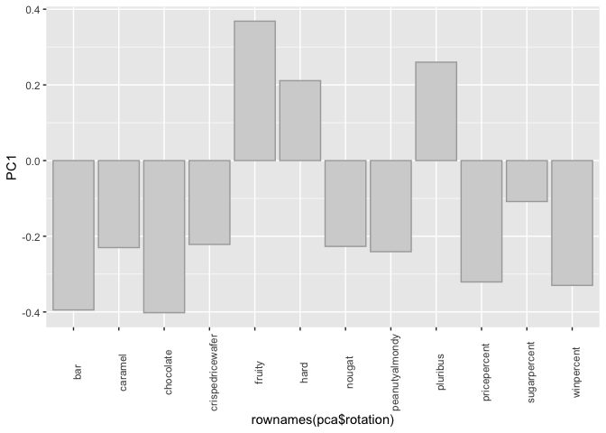

# lab10-miniproject
Meha Thakur PID 16020450

- [1. Importing candy data](#1-importing-candy-data)
- [2. What is your favorate candy?](#2-what-is-your-favorate-candy)
- [4. Taking a look at pricepercent](#4-taking-a-look-at-pricepercent)
- [5 Exploring the correlation
  structure](#5-exploring-the-correlation-structure)
- [6. Principal Component Analysis](#6-principal-component-analysis)

Happy Halloween!!

## 1. Importing candy data

``` r
#reading in data and loading packages
candy <- read.csv("candy-data.csv", row.names=1)
head(candy)
```

                 chocolate fruity caramel peanutyalmondy nougat crispedricewafer
    100 Grand            1      0       1              0      0                1
    3 Musketeers         1      0       0              0      1                0
    One dime             0      0       0              0      0                0
    One quarter          0      0       0              0      0                0
    Air Heads            0      1       0              0      0                0
    Almond Joy           1      0       0              1      0                0
                 hard bar pluribus sugarpercent pricepercent winpercent
    100 Grand       0   1        0        0.732        0.860   66.97173
    3 Musketeers    0   1        0        0.604        0.511   67.60294
    One dime        0   0        0        0.011        0.116   32.26109
    One quarter     0   0        0        0.011        0.511   46.11650
    Air Heads       0   0        0        0.906        0.511   52.34146
    Almond Joy      0   1        0        0.465        0.767   50.34755

``` r
library(dplyr)
```


    Attaching package: 'dplyr'

    The following objects are masked from 'package:stats':

        filter, lag

    The following objects are masked from 'package:base':

        intersect, setdiff, setequal, union

``` r
library(skimr)
library(rlang)
library(ggplot2)
```

The functions dim(), nrow(), table() and sum() may be useful for
answering the first 2 questions.

> Q1. How many different candy types are in this dataset?

``` r
nrow(candy)
```

    [1] 85

There are 85 candy types

> Q2. How many fruity candy types are in the dataset?

``` r
sum(candy$fruity==1)
```

    [1] 38

There are 38 fruity candy types in the dataset

## 2. What is your favorate candy?

> Q3. What is your favorite candy in the dataset and what is it’s
> winpercent value?

``` r
#example -- candy["Twix", ]$winpercent
candy["Reese's Peanut Butter cup", ]$winpercent
```

    [1] 84.18029

I love Reese’s peanut butter cups, winpercent value 84.18029

> Q4. What is the winpercent value for “Kit Kat”?

``` r
candy["Kit Kat", ]$winpercent
```

    [1] 76.7686

76.7686

> Q5. What is the winpercent value for “Tootsie Roll Snack Bars”?

``` r
candy["Tootsie Roll Snack Bars", ]$winpercent
```

    [1] 49.6535

49.6535

Hin (6 and 7): look at the “Variable type” print out from the skim()
function. Most varables (i.e. columns) are on the zero to one scale but
not all. Some columns such as chocolate are exclusively either zero or
one values.

> Q6. Is there any variable/column that looks to be on a different scale
> to the majority of the other columns in the dataset?

``` r
skim(candy)
```

|                                                  |       |
|:-------------------------------------------------|:------|
| Name                                             | candy |
| Number of rows                                   | 85    |
| Number of columns                                | 12    |
| \_\_\_\_\_\_\_\_\_\_\_\_\_\_\_\_\_\_\_\_\_\_\_   |       |
| Column type frequency:                           |       |
| numeric                                          | 12    |
| \_\_\_\_\_\_\_\_\_\_\_\_\_\_\_\_\_\_\_\_\_\_\_\_ |       |
| Group variables                                  | None  |

Data summary

**Variable type: numeric**

| skim_variable | n_missing | complete_rate | mean | sd | p0 | p25 | p50 | p75 | p100 | hist |
|:---|---:|---:|---:|---:|---:|---:|---:|---:|---:|:---|
| chocolate | 0 | 1 | 0.44 | 0.50 | 0.00 | 0.00 | 0.00 | 1.00 | 1.00 | ▇▁▁▁▆ |
| fruity | 0 | 1 | 0.45 | 0.50 | 0.00 | 0.00 | 0.00 | 1.00 | 1.00 | ▇▁▁▁▆ |
| caramel | 0 | 1 | 0.16 | 0.37 | 0.00 | 0.00 | 0.00 | 0.00 | 1.00 | ▇▁▁▁▂ |
| peanutyalmondy | 0 | 1 | 0.16 | 0.37 | 0.00 | 0.00 | 0.00 | 0.00 | 1.00 | ▇▁▁▁▂ |
| nougat | 0 | 1 | 0.08 | 0.28 | 0.00 | 0.00 | 0.00 | 0.00 | 1.00 | ▇▁▁▁▁ |
| crispedricewafer | 0 | 1 | 0.08 | 0.28 | 0.00 | 0.00 | 0.00 | 0.00 | 1.00 | ▇▁▁▁▁ |
| hard | 0 | 1 | 0.18 | 0.38 | 0.00 | 0.00 | 0.00 | 0.00 | 1.00 | ▇▁▁▁▂ |
| bar | 0 | 1 | 0.25 | 0.43 | 0.00 | 0.00 | 0.00 | 0.00 | 1.00 | ▇▁▁▁▂ |
| pluribus | 0 | 1 | 0.52 | 0.50 | 0.00 | 0.00 | 1.00 | 1.00 | 1.00 | ▇▁▁▁▇ |
| sugarpercent | 0 | 1 | 0.48 | 0.28 | 0.01 | 0.22 | 0.47 | 0.73 | 0.99 | ▇▇▇▇▆ |
| pricepercent | 0 | 1 | 0.47 | 0.29 | 0.01 | 0.26 | 0.47 | 0.65 | 0.98 | ▇▇▇▇▆ |
| winpercent | 0 | 1 | 50.32 | 14.71 | 22.45 | 39.14 | 47.83 | 59.86 | 84.18 | ▃▇▆▅▂ |

winpercent appears to be the only row with a mean more than 1, or
without 0-1 values.

> Q7. What do you think a zero and one represent for the
> candy\$chocolate column?

0 and 1 likely represent yes or no. For example, is this candy specified
(for example, Air Heads) a chocolate. It is not, according to the
dataset given by its value of zero. I agree with this evaluation.

> Q8. Plot a histogram of winpercent values

``` r
hist(candy$winpercent)
```


``` r
ggplot(candy,aes(winpercent))+
  geom_histogram(binwidth=10,fill="skyblue", col="black")
```



> Q9. Is the distribution of winpercent values symmetrical?

``` r
mean(candy$winpercent)
```

    [1] 50.31676

``` r
median(candy$winpercent)
```

    [1] 47.82975

median\<mean - data appears to have a slight left skew.

> Q10. Is the center of the distribution above or below 50%?

median\<mean - center is below 50%.

> Q11. On average is chocolate candy higher or lower ranked than fruit
> candy?

``` r
#need to find winpercent value for chocolate candy?

choc<- candy$chocolate==1 #defining chocolate candy
fruit<-candy$fruit==1 #defining fruit candy

choc.winp<-candy[choc,]$winpercent 
fruit.winp<-candy[fruit,]$winpercent 

choc.winp.avg<-mean(choc.winp) #mean of choc candy winpercent col.
fruit.winp.avg<-mean(fruit.winp) #mean of fruit candy winpercent col.

choc.winp.avg>fruit.winp.avg
```

    [1] TRUE

Yes it is.

> Q12. Is this difference statistically significant?

``` r
t.test(choc.winp,fruit.winp)
```


        Welch Two Sample t-test

    data:  choc.winp and fruit.winp
    t = 6.2582, df = 68.882, p-value = 2.871e-08
    alternative hypothesis: true difference in means is not equal to 0
    95 percent confidence interval:
     11.44563 22.15795
    sample estimates:
    mean of x mean of y 
     60.92153  44.11974 

The difference **is** statistically significant.

\##3. Overall Candy Rankings

> Q13. What are the five least liked candy types in this set?

``` r
library(dplyr)

candy.desc<-candy%>%
  arrange(winpercent)%>%
  head(5)
candy.desc
```

                       chocolate fruity caramel peanutyalmondy nougat
    Nik L Nip                  0      1       0              0      0
    Boston Baked Beans         0      0       0              1      0
    Chiclets                   0      1       0              0      0
    Super Bubble               0      1       0              0      0
    Jawbusters                 0      1       0              0      0
                       crispedricewafer hard bar pluribus sugarpercent pricepercent
    Nik L Nip                         0    0   0        1        0.197        0.976
    Boston Baked Beans                0    0   0        1        0.313        0.511
    Chiclets                          0    0   0        1        0.046        0.325
    Super Bubble                      0    0   0        0        0.162        0.116
    Jawbusters                        0    1   0        1        0.093        0.511
                       winpercent
    Nik L Nip            22.44534
    Boston Baked Beans   23.41782
    Chiclets             24.52499
    Super Bubble         27.30386
    Jawbusters           28.12744

The 5 least popular candy are Nik L Nip, Boston Baked Beans, Chiclets,
Super Bubble, and Jawbusters

> Q14. What are the top 5 all time favorite candy types out of this set?

``` r
candy.asc<-candy%>%
  arrange(winpercent)%>%
  tail(5)
candy.asc
```

                              chocolate fruity caramel peanutyalmondy nougat
    Snickers                          1      0       1              1      1
    Kit Kat                           1      0       0              0      0
    Twix                              1      0       1              0      0
    Reese's Miniatures                1      0       0              1      0
    Reese's Peanut Butter cup         1      0       0              1      0
                              crispedricewafer hard bar pluribus sugarpercent
    Snickers                                 0    0   1        0        0.546
    Kit Kat                                  1    0   1        0        0.313
    Twix                                     1    0   1        0        0.546
    Reese's Miniatures                       0    0   0        0        0.034
    Reese's Peanut Butter cup                0    0   0        0        0.720
                              pricepercent winpercent
    Snickers                         0.651   76.67378
    Kit Kat                          0.511   76.76860
    Twix                             0.906   81.64291
    Reese's Miniatures               0.279   81.86626
    Reese's Peanut Butter cup        0.651   84.18029

The 5 most popular are Reese’s Peanut Butter cups, Reese’s Miniatures,
Twix, Kit Kat, Snickers.

> Q15. Make a first barplot of candy ranking based on winpercent values.

``` r
#simple plot not ordered
ggplot(candy,aes(winpercent,rownames(candy)))+
  geom_bar(stat="identity")
```


``` r
#defining colours
my_cols=rep("black", nrow(candy))
my_cols[as.logical(candy$chocolate)] = "chocolate"
my_cols[as.logical(candy$bar)] = "brown"
my_cols[as.logical(candy$fruity)] = "pink"

#plot organised by colour
ggplot(candy) + 
  aes(winpercent, reorder(rownames(candy),winpercent)) +
  geom_col(fill=my_cols) +
  theme(axis.text.y = element_text(size = 3))
```



Now, for the first time, using this plot we can answer questions like:
\> Q17. What is the worst ranked chocolate candy?

Sixlets

> Q18. What is the best ranked fruity candy?

Starburst

## 4. Taking a look at pricepercent

``` r
library(ggrepel)

# How about a plot of price vs win
ggplot(candy) +
  aes(winpercent, pricepercent, label=rownames(candy)) +
  geom_point(col=my_cols) + 
  geom_text_repel(col=my_cols, size=3.3, max.overlaps = 30)
```



> Q19. Which candy type is the highest ranked in terms of winpercent for
> the least money - i.e. offers the most bang for your buck?

Reese’s Miniatures

> Q20. What are the top 5 most expensive candy types in the dataset and
> of these which is the least popular?

``` r
ord <- order(candy$pricepercent, decreasing = TRUE)
head(candy[ord,c(11,12)], n=5)
```

                             pricepercent winpercent
    Nik L Nip                       0.976   22.44534
    Nestle Smarties                 0.976   37.88719
    Ring pop                        0.965   35.29076
    Hershey's Krackel               0.918   62.28448
    Hershey's Milk Chocolate        0.918   56.49050

Nik L Nip, Nestle Smarties, Ring pop, Hershey’s Krackel, Hershey’s Milk
Chocolate

> OPTIONAL Q21. Make a barplot again with geom_col() this time using
> pricepercent and then improve this step by step, first ordering the
> x-axis by value and finally making a so called “dot chat” or
> “lollipop” chart by swapping geom_col() for geom_point() +
> geom_segment().

## 5 Exploring the correlation structure

``` r
library(corrplot)
```

    corrplot 0.95 loaded

``` r
cij <- cor(candy)
corrplot(cij)
```


> Q22. Examining this plot what two variables are anti-correlated
> (i.e. have minus values)?

Fruity and Chocolate

> Q23. Similarly, what two variables are most positively correlated?

Bar and Chocolate, Chocolate and Winpercent. I am choosing to not count
the self comparisons (dark blue circles) since these will be 1 by
default.

## 6. Principal Component Analysis

``` r
pca <- prcomp(candy, scale=TRUE)
summary(pca)
```

    Importance of components:
                              PC1    PC2    PC3     PC4    PC5     PC6     PC7
    Standard deviation     2.0788 1.1378 1.1092 1.07533 0.9518 0.81923 0.81530
    Proportion of Variance 0.3601 0.1079 0.1025 0.09636 0.0755 0.05593 0.05539
    Cumulative Proportion  0.3601 0.4680 0.5705 0.66688 0.7424 0.79830 0.85369
                               PC8     PC9    PC10    PC11    PC12
    Standard deviation     0.74530 0.67824 0.62349 0.43974 0.39760
    Proportion of Variance 0.04629 0.03833 0.03239 0.01611 0.01317
    Cumulative Proportion  0.89998 0.93832 0.97071 0.98683 1.00000

``` r
plot(pca$x[,1:2])
```


``` r
pc1<-pca$x[,1]


ggplot(pca$x,aes(PC1,PC2,label=rownames(pca$x)))+
  geom_point(col=my_cols)+
  geom_text_repel(col=my_cols,max.overlaps=100) #increased max overlap to see everything - but is a little crowded
```



We can change the plotting character and add some color:

``` r
plot(pca$x[,1:2], col=my_cols, pch=16)
```


nicer plot with ggplot

``` r
# Make a new data-frame with our PCA results and candy data
my_data <- cbind(candy, pca$x[,1:3])

p <- ggplot(my_data) + 
        aes(x=PC1, y=PC2, 
            size=winpercent/100,  
            text=rownames(my_data),
            label=rownames(my_data)) +
        geom_point(col=my_cols)

p
```


adding in labels

``` r
p + geom_text_repel(size=3.3, col=my_cols, max.overlaps = 50)  + 
  theme(legend.position = "none") +
  labs(title="Halloween Candy PCA Space",
       subtitle="Colored by type: chocolate bar (dark brown), chocolate other (light brown), fruity (red), other (black)",
       caption="Data from 538")
```



using plotly to generate an interactive plot

``` r
library(plotly)
```


    Attaching package: 'plotly'

    The following object is masked from 'package:ggplot2':

        last_plot

    The following object is masked from 'package:stats':

        filter

    The following object is masked from 'package:graphics':

        layout

``` r
#ggplotly(p)

par(mar=c(8,4,2,2))
barplot(pca$rotation[,1], las=2, ylab="PC1 Contribution")
```


``` r
pca$rotation
```

                            PC1         PC2         PC3          PC4          PC5
    chocolate        -0.4019466  0.21404160 -0.01601358  0.016673032 -0.066035846
    fruity            0.3683883 -0.18304666  0.13765612  0.004479829 -0.143535325
    caramel          -0.2299709 -0.40349894  0.13294166  0.024889542  0.507301501
    peanutyalmondy   -0.2407155  0.22446919 -0.18272802 -0.466784287 -0.399930245
    nougat           -0.2268102 -0.47016599 -0.33970244 -0.299581403  0.188852418
    crispedricewafer -0.2215182  0.09719527  0.36485542  0.605594730 -0.034652316
    hard              0.2111587 -0.43262603  0.20295368  0.032249660 -0.574557816
    bar              -0.3947433 -0.22255618 -0.10696092  0.186914549 -0.077794806
    pluribus          0.2600041  0.36920922  0.26813772 -0.287246604  0.392796479
    sugarpercent     -0.1083088 -0.23647379  0.65509692 -0.433896248 -0.007469103
    pricepercent     -0.3207361  0.05883628  0.33048843 -0.063557149 -0.043358887
    winpercent       -0.3298035  0.21115347  0.13531766 -0.117930997 -0.168755073
                             PC6         PC7         PC8          PC9         PC10
    chocolate         0.09018950  0.08360642 -0.49084856  0.151651568  0.107661356
    fruity            0.04266105 -0.46147889  0.39805802  0.001248306  0.362062502
    caramel           0.40346502  0.44274741  0.26963447 -0.019186442  0.229799010
    peanutyalmondy    0.09416259  0.25710489  0.45771445 -0.381068550 -0.145912362
    nougat           -0.09012643 -0.36663902 -0.18793955 -0.385278987  0.011323453
    crispedricewafer  0.09007640 -0.13077042  0.13567736 -0.511634999 -0.264810144
    hard              0.12767365  0.31933477 -0.38881683 -0.258154433  0.220779142
    bar              -0.25307332 -0.24192992 -0.02982691 -0.091872886 -0.003232321
    pluribus         -0.03184932 -0.04066352 -0.28652547 -0.529954405  0.199303452
    sugarpercent     -0.02737834 -0.14721840 -0.04114076  0.217685759 -0.488103337
    pricepercent     -0.62908570  0.14308215  0.16722078  0.048991557  0.507716043
    winpercent        0.56947283 -0.40260385 -0.02936405  0.124440117  0.358431235
                            PC11        PC12
    chocolate        -0.10045278 -0.69784924
    fruity           -0.17494902 -0.50624242
    caramel          -0.13515820 -0.07548984
    peanutyalmondy   -0.11244275 -0.12972756
    nougat            0.38954473 -0.09223698
    crispedricewafer  0.22615618 -0.11727369
    hard             -0.01342330  0.10430092
    bar              -0.74956878  0.22010569
    pluribus         -0.27971527  0.06169246
    sugarpercent     -0.05373286 -0.04733985
    pricepercent      0.26396582  0.06698291
    winpercent        0.11251626  0.37693153

``` r
ggplot(pca$rotation,aes(rownames(pca$rotation),y=PC1))+
  geom_bar(stat="identity",col="darkgrey",fill="lightgrey")+
  theme(axis.text.x = element_text(angle = 90))
```



> Q24. What original variables are picked up strongly by PC1 in the
> positive direction? Do these make sense to you?

Fruity is the strongest positive variable in PC1. Other positive
variables that are not as strong are hard and pluribus. This means that
these variables correlate together, which makes logical sense since most
fruity candy is hard and come in multiples. As PC1 value goes up
(further along the x axis), these variables increase.
