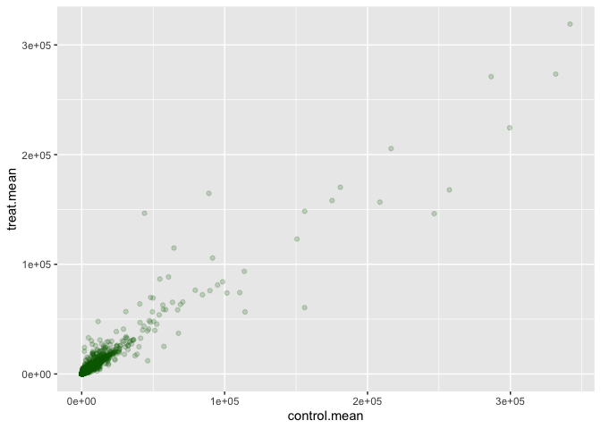
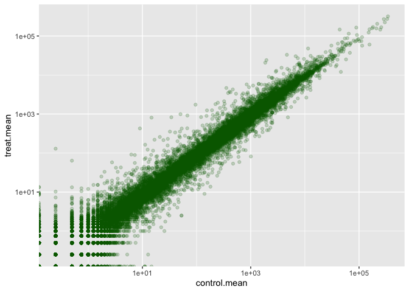
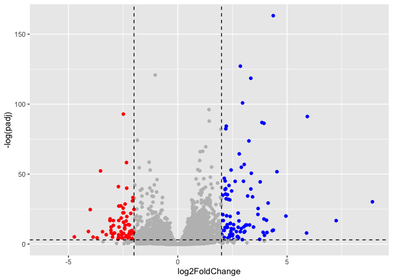

# Lab12
Meha Thakur (PID 16020450)

- [Toy analysis example](#toy-analysis-example)
- [Volcano plot](#volcano-plot)
- [Save our results](#save-our-results)
- [Pathway analysis](#pathway-analysis)

\##Background

RNA-seq: after all the alignments and whatnot the result is a **count
matrix**. Columns are the experiments (+/- drug, KO, etc.)

countData -\> input for DESeq2 colData-\> tells you about the design of
the experiment. Rows match columns from count data. Metadata folder.

Today we will analyse some RNASeq data from Himes et al. on the effects
of a commons teroid (dex) on airway smooth muscle cells (ASMs). For this
analysis, we need two main inputs.

1.  countData: table of **counts** per gene (in rows) across experiments
    (in columns)
2.  colData: **metadata** about the design of the experiments. Rows here
    match columns in `countdata`

loading libraries

``` r
library(BiocManager)
library(DESeq2)
library(ggplot2)
library(dplyr)
```

\##Data Import

``` r
counts<-read.csv("airway_scaledcounts.csv",row.names=1)
metadata<-read.csv("airway_metadata.csv")
```

Lets have a wee peak

``` r
head(counts)
```

                    SRR1039508 SRR1039509 SRR1039512 SRR1039513 SRR1039516
    ENSG00000000003        723        486        904        445       1170
    ENSG00000000005          0          0          0          0          0
    ENSG00000000419        467        523        616        371        582
    ENSG00000000457        347        258        364        237        318
    ENSG00000000460         96         81         73         66        118
    ENSG00000000938          0          0          1          0          2
                    SRR1039517 SRR1039520 SRR1039521
    ENSG00000000003       1097        806        604
    ENSG00000000005          0          0          0
    ENSG00000000419        781        417        509
    ENSG00000000457        447        330        324
    ENSG00000000460         94        102         74
    ENSG00000000938          0          0          0

``` r
head(metadata)
```

              id     dex celltype     geo_id
    1 SRR1039508 control   N61311 GSM1275862
    2 SRR1039509 treated   N61311 GSM1275863
    3 SRR1039512 control  N052611 GSM1275866
    4 SRR1039513 treated  N052611 GSM1275867
    5 SRR1039516 control  N080611 GSM1275870
    6 SRR1039517 treated  N080611 GSM1275871

ENSG –\> gene code. Each one corresponds SRR–\> experiment details,
explained in metadata file. geo_id

> Q1. How many “genes” are in this dataset

``` r
nrow(counts)
```

    [1] 38694

There are 38694 genes in this dataset

> Q2. How many experiments (i.e. columns in counts, or rows in metadata)

``` r
ncol(counts)
```

    [1] 8

``` r
nrow(metadata)
```

    [1] 8

8 experiments

> Q3. How many “control” experiments are there

``` r
sum(metadata$dex=="control")
```

    [1] 4

4 control conditions

## Toy analysis example

**Step 1:** Extract the “control” columns from `counts` **Step 2:**
Calculate the mean value for each gene in these “control” columns

**Steps 3-4:** Do the same for the “treated” columns **Step 5:** Compare

Step 1

``` r
control.inds<-metadata$dex=="control" #use this to access the control the columns
control.counts<-counts[ , control.inds] #making a control count matrix
```

Step 2

``` r
control.mean<-rowMeans(control.counts)
```

Steps 3, 4

``` r
treat.inds<-metadata$dex=="treated"
treat.counts<-counts[,treat.inds]
treat.mean<-rowMeans(treat.counts)
```

For ease of book-keeping, we can store these together in one df -
`meancounts`

``` r
meancounts<-data.frame(control.mean, treat.mean)
head(meancounts)
```

                    control.mean treat.mean
    ENSG00000000003       900.75     658.00
    ENSG00000000005         0.00       0.00
    ENSG00000000419       520.50     546.00
    ENSG00000000457       339.75     316.50
    ENSG00000000460        97.25      78.75
    ENSG00000000938         0.75       0.00

Step 5: Compare

``` r
ggplot(meancounts,aes(control.mean,treat.mean))+
  geom_point(alpha=0.2,col="darkgreen")
```



This does not look like 38000 data points

Use log scale to account for the heavy skew.

``` r
ggplot(meancounts,aes(control.mean,treat.mean))+
  geom_point(alpha=0.2,col="darkgreen")+
  scale_x_log10()+
  scale_y_log10()
```

    Warning in scale_x_log10(): log-10 transformation introduced infinite values.

    Warning in scale_y_log10(): log-10 transformation introduced infinite values.



Points along the diagonal likely have no change - this is a heavy
portion of the data. To account for this, we calculate “fold change” as
a way to see differences. Generally for fold change we use log2 - Why?

``` r
#treated/control
10/10
```

    [1] 1

``` r
log2(10/10) #log2 says that there is no change here. 
```

    [1] 0

``` r
log2(20/10) #expression increased with treatment
```

    [1] 1

``` r
log2(10/20) #expression decreased with treatment
```

    [1] -1

``` r
#treated/control
meancounts$log2fc<-log2(meancounts$treat.mean/
                          meancounts$control.mean)
head(meancounts)
```

                    control.mean treat.mean      log2fc
    ENSG00000000003       900.75     658.00 -0.45303916
    ENSG00000000005         0.00       0.00         NaN
    ENSG00000000419       520.50     546.00  0.06900279
    ENSG00000000457       339.75     316.50 -0.10226805
    ENSG00000000460        97.25      78.75 -0.30441833
    ENSG00000000938         0.75       0.00        -Inf

NaN, -Inf - not a number, -infinity. 0/0 is not a number, so we can
either add pseudocounts or just filter it out.

A common rule-of-thumb for calling something upregulated is a log2FC \>
+2, downregulated log2FC \< -2

filter out zero

``` r
#filter out zero count genes

#nonzero.inds<-rowSums(counts!=0)
#mycounts<-meancounts[nonzero.inds,]
#nrow(mycounts)

#OR
zero.inds<-which(meancounts[,1:2] == 0,arr.ind=T)[,1]
mygenes<-meancounts[-zero.inds,]
head(mygenes)
```

                    control.mean treat.mean      log2fc
    ENSG00000000003       900.75     658.00 -0.45303916
    ENSG00000000419       520.50     546.00  0.06900279
    ENSG00000000457       339.75     316.50 -0.10226805
    ENSG00000000460        97.25      78.75 -0.30441833
    ENSG00000000971      5219.00    6687.50  0.35769358
    ENSG00000001036      2327.00    1785.75 -0.38194109

> Q. how many genes are upregulated

``` r
sum(mygenes$log2fc>=2)
```

    [1] 314

> Q. how many genes are downregulated

``` r
sum(mygenes$log2fc <= -2)
```

    [1] 485

This is good, however this has no statistical significance attached to
it. We need to calculate that - can be done with DESeq

\##DESeq analysis

``` r
dds<-DESeqDataSetFromMatrix(countData = counts,
                            colData=metadata,
                            design=~dex)
```

    converting counts to integer mode

    Warning in DESeqDataSet(se, design = design, ignoreRank): some variables in
    design formula are characters, converting to factors

The main function in the DESeq package to run analysis is called
`DESeq()`

``` r
dds<-DESeq(dds)
```

    estimating size factors

    estimating dispersions

    gene-wise dispersion estimates

    mean-dispersion relationship

    final dispersion estimates

    fitting model and testing

results

``` r
res<-results(dds)
head(res)
```

    log2 fold change (MLE): dex treated vs control 
    Wald test p-value: dex treated vs control 
    DataFrame with 6 rows and 6 columns
                      baseMean log2FoldChange     lfcSE      stat    pvalue
                     <numeric>      <numeric> <numeric> <numeric> <numeric>
    ENSG00000000003 747.194195     -0.3507030  0.168246 -2.084470 0.0371175
    ENSG00000000005   0.000000             NA        NA        NA        NA
    ENSG00000000419 520.134160      0.2061078  0.101059  2.039475 0.0414026
    ENSG00000000457 322.664844      0.0245269  0.145145  0.168982 0.8658106
    ENSG00000000460  87.682625     -0.1471420  0.257007 -0.572521 0.5669691
    ENSG00000000938   0.319167     -1.7322890  3.493601 -0.495846 0.6200029
                         padj
                    <numeric>
    ENSG00000000003  0.163035
    ENSG00000000005        NA
    ENSG00000000419  0.176032
    ENSG00000000457  0.961694
    ENSG00000000460  0.815849
    ENSG00000000938        NA

baseMean- mean value across all columns log2FC - pval - padj - 5% of
36000 things is still a large number. So we adjust the pvalues to
account for this - batch correction.

``` r
36000*0.05
```

    [1] 1800

## Volcano plot

This is a plot of log2FC vs. adjusted pval (padj)

``` r
mycols <- rep("grey",nrow(res))
mycols[res$log2FoldChange<=-2 & res$padj<0.05]<-"red"
mycols[res$log2FoldChange>=2 & res$padj<0.05]<-"blue"

ggplot(res, aes(log2FoldChange,-log(padj)))+
  geom_point(col=mycols)+
  geom_vline(xintercept=c(-2,2), color = "black", linetype = "dashed")+
  geom_hline(yintercept = -log(0.05),color = "black", linetype = "dashed")
```

    Warning: Removed 23549 rows containing missing values or values outside the scale range
    (`geom_point()`).



``` r
#we take -log2FC
```

## Save our results

``` r
write.csv(res,file="myresults.csv")
```

## Pathway analysis

Trying to see if up/downregulated genes of interest are implicated in
any pathways. Differentially expressed genes come from the experiment
within the thresholds you set.

Try and generate KEGG pathway

first need to add annotation data. use `mapIds()` function from
bioconductor to map ENSG IDs to genes.

``` r
library("AnnotationDbi")
```


    Attaching package: 'AnnotationDbi'

    The following object is masked from 'package:dplyr':

        select

``` r
library("org.Hs.eg.db")
```

org.Hs.eg.db is the organism (org) annotation package for HomoSapiens
(Hs) for Entrez Gene IDs (eg), organised as a database package (db)

prints out what database id formats we can translate between. We have
ENSEMBL format, can translate to anything - we will choose SYMBOL for
now.

``` r
columns(org.Hs.eg.db) #all available key types
```

     [1] "ACCNUM"       "ALIAS"        "ENSEMBL"      "ENSEMBLPROT"  "ENSEMBLTRANS"
     [6] "ENTREZID"     "ENZYME"       "EVIDENCE"     "EVIDENCEALL"  "GENENAME"    
    [11] "GENETYPE"     "GO"           "GOALL"        "IPI"          "MAP"         
    [16] "OMIM"         "ONTOLOGY"     "ONTOLOGYALL"  "PATH"         "PFAM"        
    [21] "PMID"         "PROSITE"      "REFSEQ"       "SYMBOL"       "UCSCKG"      
    [26] "UNIPROT"     

``` r
res$symbol<-mapIds(org.Hs.eg.db,
                   keys = row.names(res), #gene names
                   keytype = "ENSEMBL", #current format
                   column = "SYMBOL") #what we want 
```

    'select()' returned 1:many mapping between keys and columns

``` r
head(res$symbol)
```

    ENSG00000000003 ENSG00000000005 ENSG00000000419 ENSG00000000457 ENSG00000000460 
           "TSPAN6"          "TNMD"          "DPM1"         "SCYL3"      "C1orf112" 
    ENSG00000000938 
              "FGR" 

add `GENENAME` then `ENTREZID`

``` r
res$genename<-mapIds(org.Hs.eg.db,
                   keys = row.names(res), #gene names
                   keytype = "ENSEMBL", #current format
                   column = "GENENAME") #what we want 
```

    'select()' returned 1:many mapping between keys and columns

``` r
head(res$genename)
```

                                                  ENSG00000000003 
                                                  "tetraspanin 6" 
                                                  ENSG00000000005 
                                                    "tenomodulin" 
                                                  ENSG00000000419 
    "dolichyl-phosphate mannosyltransferase subunit 1, catalytic" 
                                                  ENSG00000000457 
                                       "SCY1 like pseudokinase 3" 
                                                  ENSG00000000460 
                            "chromosome 1 open reading frame 112" 
                                                  ENSG00000000938 
                 "FGR proto-oncogene, Src family tyrosine kinase" 

``` r
res$entrezid<-mapIds(org.Hs.eg.db,
                   keys = row.names(res), #gene names
                   keytype = "ENSEMBL", #current format
                   column = "ENTREZID") #what we want 
```

    'select()' returned 1:many mapping between keys and columns

``` r
head(res$entrezid)
```

    ENSG00000000003 ENSG00000000005 ENSG00000000419 ENSG00000000457 ENSG00000000460 
             "7105"         "64102"          "8813"         "57147"         "55732" 
    ENSG00000000938 
             "2268" 

``` r
head(res)
```

    log2 fold change (MLE): dex treated vs control 
    Wald test p-value: dex treated vs control 
    DataFrame with 6 rows and 9 columns
                      baseMean log2FoldChange     lfcSE      stat    pvalue
                     <numeric>      <numeric> <numeric> <numeric> <numeric>
    ENSG00000000003 747.194195     -0.3507030  0.168246 -2.084470 0.0371175
    ENSG00000000005   0.000000             NA        NA        NA        NA
    ENSG00000000419 520.134160      0.2061078  0.101059  2.039475 0.0414026
    ENSG00000000457 322.664844      0.0245269  0.145145  0.168982 0.8658106
    ENSG00000000460  87.682625     -0.1471420  0.257007 -0.572521 0.5669691
    ENSG00000000938   0.319167     -1.7322890  3.493601 -0.495846 0.6200029
                         padj      symbol               genename    entrezid
                    <numeric> <character>            <character> <character>
    ENSG00000000003  0.163035      TSPAN6          tetraspanin 6        7105
    ENSG00000000005        NA        TNMD            tenomodulin       64102
    ENSG00000000419  0.176032        DPM1 dolichyl-phosphate m..        8813
    ENSG00000000457  0.961694       SCYL3 SCY1 like pseudokina..       57147
    ENSG00000000460  0.815849    C1orf112 chromosome 1 open re..       55732
    ENSG00000000938        NA         FGR FGR proto-oncogene, ..        2268

save results

``` r
write.csv(res, file = "myresults_annotated.csv")
```

``` r
library(pathview)
```

    ##############################################################################
    Pathview is an open source software package distributed under GNU General
    Public License version 3 (GPLv3). Details of GPLv3 is available at
    http://www.gnu.org/licenses/gpl-3.0.html. Particullary, users are required to
    formally cite the original Pathview paper (not just mention it) in publications
    or products. For details, do citation("pathview") within R.

    The pathview downloads and uses KEGG data. Non-academic uses may require a KEGG
    license agreement (details at http://www.kegg.jp/kegg/legal.html).
    ##############################################################################

``` r
library(gage)
```

``` r
library(gageData)

data(kegg.sets.hs)

# Examine the first 2 pathways in this kegg set for humans
head(kegg.sets.hs, 2)
```

    $`hsa00232 Caffeine metabolism`
    [1] "10"   "1544" "1548" "1549" "1553" "7498" "9"   

    $`hsa00983 Drug metabolism - other enzymes`
     [1] "10"     "1066"   "10720"  "10941"  "151531" "1548"   "1549"   "1551"  
     [9] "1553"   "1576"   "1577"   "1806"   "1807"   "1890"   "221223" "2990"  
    [17] "3251"   "3614"   "3615"   "3704"   "51733"  "54490"  "54575"  "54576" 
    [25] "54577"  "54578"  "54579"  "54600"  "54657"  "54658"  "54659"  "54963" 
    [33] "574537" "64816"  "7083"   "7084"   "7172"   "7363"   "7364"   "7365"  
    [41] "7366"   "7367"   "7371"   "7372"   "7378"   "7498"   "79799"  "83549" 
    [49] "8824"   "8833"   "9"      "978"   

**gage** wants an input that is a named vector of importance See NA
values - need to filter these out. Want names too.

``` r
foldchanges = res$log2FoldChange
names(foldchanges)<- res$entrezid
head(foldchanges)
```

           7105       64102        8813       57147       55732        2268 
    -0.35070302          NA  0.20610777  0.02452695 -0.14714205 -1.73228897 

now I can run gage analysis

``` r
data(kegg.sets.hs)
keggres = gage(foldchanges, gsets=kegg.sets.hs)
```

what is in the results:

``` r
attributes(keggres)
```

    $names
    [1] "greater" "less"    "stats"  

``` r
head(keggres$less,5) #top 5 pathways being annotated
```

                                                             p.geomean stat.mean
    hsa05332 Graft-versus-host disease                    0.0004250461 -3.473346
    hsa04940 Type I diabetes mellitus                     0.0017820293 -3.002352
    hsa05310 Asthma                                       0.0020045888 -3.009050
    hsa04672 Intestinal immune network for IgA production 0.0060434515 -2.560547
    hsa05330 Allograft rejection                          0.0073678825 -2.501419
                                                                 p.val      q.val
    hsa05332 Graft-versus-host disease                    0.0004250461 0.09053483
    hsa04940 Type I diabetes mellitus                     0.0017820293 0.14232581
    hsa05310 Asthma                                       0.0020045888 0.14232581
    hsa04672 Intestinal immune network for IgA production 0.0060434515 0.31387180
    hsa05330 Allograft rejection                          0.0073678825 0.31387180
                                                          set.size         exp1
    hsa05332 Graft-versus-host disease                          40 0.0004250461
    hsa04940 Type I diabetes mellitus                           42 0.0017820293
    hsa05310 Asthma                                             29 0.0020045888
    hsa04672 Intestinal immune network for IgA production       47 0.0060434515
    hsa05330 Allograft rejection                                36 0.0073678825

lets look at one of these hsa05310 Asthma

``` r
pathview(gene.data=foldchanges,pathway.id="hsa05310")
```


