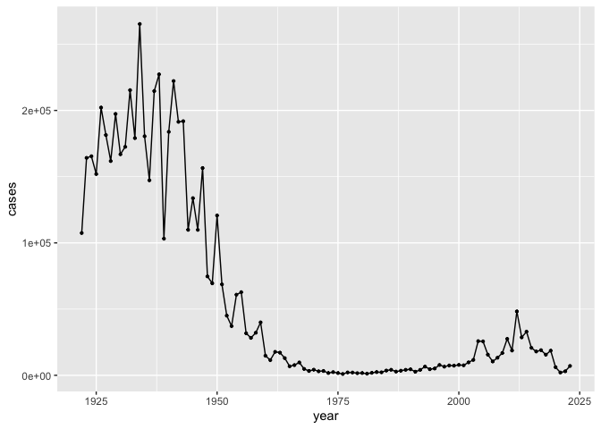
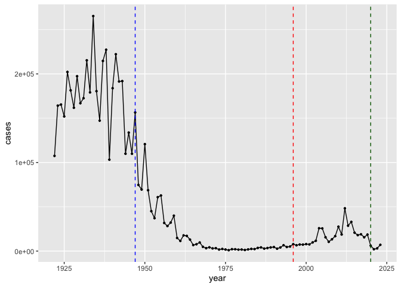
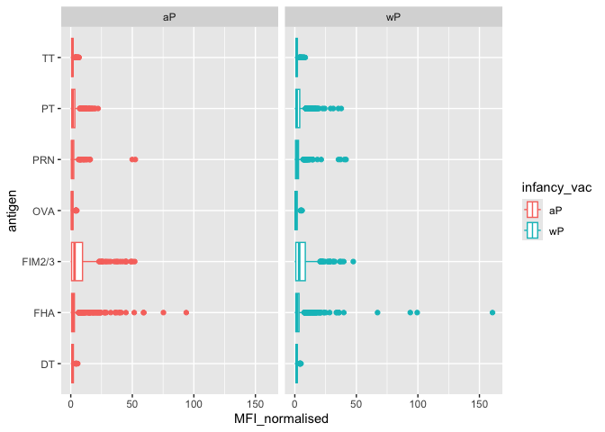
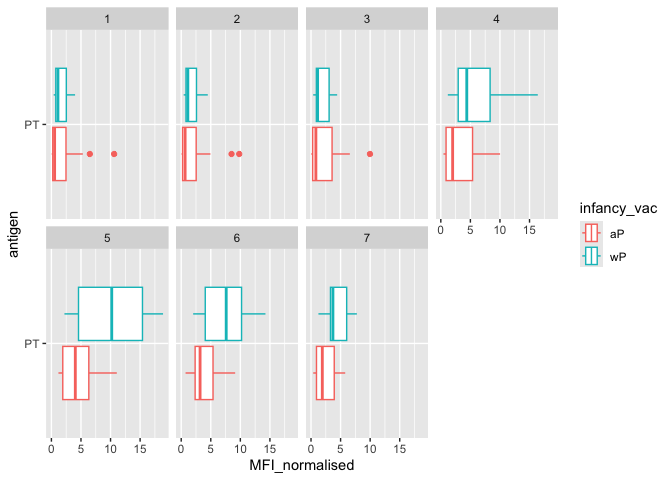

# lab19: Pertussis Mini Project
Meha Thakur PID A16020450

- [1. Investigating pertussis cases by year - warm
  up](#1-investigating-pertussis-cases-by-year---warm-up)
- [CMI-PB project](#cmi-pb-project)
- [Focus on IgG](#focus-on-igg)
  - [Diffrence between aP and wP?](#diffrence-between-ap-and-wp)
- [Time course analysis](#time-course-analysis)
- [Time course of PT](#time-course-of-pt)
- [System setup - prints out information about my setup to run this
  analysis.](#system-setup---prints-out-information-about-my-setup-to-run-this-analysis)

Pertussis (whooping cough) is a highly infectious lung infection caused
by the bacteria *B. Pertussis*. The CDC tracks case numbers in the US
and makes this data available online:
https://www.cdc.gov/pertussis/php/surveillance/pertussis-cases-by-year.html?CDC_AAref_Val=https://www.cdc.gov/pertussis/surv-reporting/cases-by-year.html

## 1. Investigating pertussis cases by year - warm up

> Q1. With the help of the R “addin” package datapasta assign the CDC
> pertussis case number data to a data frame called cdc and use ggplot
> to make a plot of cases numbers over time.

Theres no link to a csv file, so we need to scrape this data from the
webpage. Use datapasta package. Copy the data table you want from a
website, then click addins on the top menu, and paste as dataframe in
the ‘datapasta’ section.

make graph - cases over time

``` r
library(ggplot2)

ggplot(cdc, aes(year, cases))+
  geom_line()+
  geom_point(size=0.8)
```



> Q2. Using the ggplot geom_vline() function add lines to your previous
> plot for the 1946 introduction of the wP (whole cell) vaccine,
> deployment in 1947, and the 1996 switch to aP vaccine (see example in
> the hint below). Add a line for 2020, also.

``` r
ggplot(cdc, aes(year, cases))+
  geom_line()+
  geom_point(size=0.8)+
  geom_vline(xintercept=1947, col="blue", linetype="dashed")+
  geom_vline(xintercept=1996, col="red",linetype="dashed")+
  geom_vline(xintercept=2020, col="darkgreen",linetype="dashed")
```



> Q3. Describe what happened after the introduction of the aP vaccine?
> Do you have a possible explanation for the observed trend?

Why is there a spike in the mid-2000s? Anti-vaccine movement perhaps?
Introduction of social media in the 2010s was able to spread
anti-vacicne rhetoric. Maybe Ap and Wp vaccines have a fundamental
difference in lasting immunity, Ap perhaps doesn’t have as long-lasting
of an immunity as Wp hence the need for boosters that not everyone may
get.

**Why does aP induced protection wane faster than Wp?**

## CMI-PB project

The CMI-Pertussis Boost (PB) project focusses on gathering data for this
topic,. What is disctinct between aP and wP individuals over time. Data
is available in a JSON format, can be read in with `read_jason()` in the
**jsonlite** package.

``` r
library(jsonlite)

subject<-read_json("https://www.cmi-pb.org/api/v5_1/subject",
                   simplifyVector = TRUE)
head(subject)
```

      subject_id infancy_vac biological_sex              ethnicity  race
    1          1          wP         Female Not Hispanic or Latino White
    2          2          wP         Female Not Hispanic or Latino White
    3          3          wP         Female                Unknown White
    4          4          wP           Male Not Hispanic or Latino Asian
    5          5          wP           Male Not Hispanic or Latino Asian
    6          6          wP         Female Not Hispanic or Latino White
      year_of_birth date_of_boost      dataset
    1    1986-01-01    2016-09-12 2020_dataset
    2    1968-01-01    2019-01-28 2020_dataset
    3    1983-01-01    2016-10-10 2020_dataset
    4    1988-01-01    2016-08-29 2020_dataset
    5    1991-01-01    2016-08-29 2020_dataset
    6    1988-01-01    2016-10-10 2020_dataset

> Q4. How many “subjects” are in this dataset

``` r
nrow(subject)
```

    [1] 172

ans: 172 subjects

> Q5. How many wP and aP primed subjects are there in this dataset

``` r
table(subject$infancy_vac)
```


    aP wP 
    87 85 

There are 87 aP and 85 wP subjects in this dataset.

> Q6. What is the `biological sex` and `race` breakdown of these
> subjects - is this representative of a population

``` r
table(subject$race,subject$biological_sex)
```

                                               
                                                Female Male
      American Indian/Alaska Native                  0    1
      Asian                                         32   12
      Black or African American                      2    3
      More Than One Race                            15    4
      Native Hawaiian or Other Pacific Islander      1    1
      Unknown or Not Reported                       14    7
      White                                         48   32

overrepresentation of white females in this dataset - not representative
of the US dataset.

Lets read more tables from the CBI-PB databse API. Specimen IDs stay
consistent between dataframes

``` r
specimen<-read_json("http://cmi-pb.org/api/v5_1/specimen", simplifyVector = TRUE)
ab_titer<-read_json("http://cmi-pb.org/api/v5_1/plasma_ab_titer", simplifyVector = TRUE)
```

Want to take subject and speciment table, and merge them using
`inner_join()` or `full_join()`. inner join takes whats common between
the two datasets, vs full join will just add everything even if data is
missing form one dataset. We want to use inner join in `dplyr`

``` r
library(dplyr)
```


    Attaching package: 'dplyr'

    The following objects are masked from 'package:stats':

        filter, lag

    The following objects are masked from 'package:base':

        intersect, setdiff, setequal, union

``` r
meta<-inner_join(subject,specimen)
```

    Joining with `by = join_by(subject_id)`

``` r
head(meta) #notice it says joined by suject ID, since that is the common column between the two dfs
```

      subject_id infancy_vac biological_sex              ethnicity  race
    1          1          wP         Female Not Hispanic or Latino White
    2          1          wP         Female Not Hispanic or Latino White
    3          1          wP         Female Not Hispanic or Latino White
    4          1          wP         Female Not Hispanic or Latino White
    5          1          wP         Female Not Hispanic or Latino White
    6          1          wP         Female Not Hispanic or Latino White
      year_of_birth date_of_boost      dataset specimen_id
    1    1986-01-01    2016-09-12 2020_dataset           1
    2    1986-01-01    2016-09-12 2020_dataset           2
    3    1986-01-01    2016-09-12 2020_dataset           3
    4    1986-01-01    2016-09-12 2020_dataset           4
    5    1986-01-01    2016-09-12 2020_dataset           5
    6    1986-01-01    2016-09-12 2020_dataset           6
      actual_day_relative_to_boost planned_day_relative_to_boost specimen_type
    1                           -3                             0         Blood
    2                            1                             1         Blood
    3                            3                             3         Blood
    4                            7                             7         Blood
    5                           11                            14         Blood
    6                           32                            30         Blood
      visit
    1     1
    2     2
    3     3
    4     4
    5     5
    6     6

``` r
#also want to join the antibody titer table

ab_data<-inner_join(meta,ab_titer) #this is quite a big dataframe now.
```

    Joining with `by = join_by(specimen_id)`

> Q7. how many different antibody isotypes are there

``` r
unique(ab_data$isotype)
```

    [1] "IgE"  "IgG"  "IgG1" "IgG2" "IgG3" "IgG4"

There are 6 isotypes

> Q8. How many different antigens are there

``` r
unique(ab_data$antigen)
```

     [1] "Total"   "PT"      "PRN"     "FHA"     "ACT"     "LOS"     "FELD1"  
     [8] "BETV1"   "LOLP1"   "Measles" "PTM"     "FIM2/3"  "TT"      "DT"     
    [15] "OVA"     "PD1"    

There are 16 types of antigens. Measles can be considered a negative
control?

> Q9. Lets plot MFI vs. antigen

``` r
ggplot(ab_data, aes(MFI, antigen))+
  geom_boxplot()
```

    Warning: Removed 1 row containing non-finite outside the scale range
    (`stat_boxplot()`).


## Focus on IgG

IgG is crucial for long-term immunity and respondign to bacterial/viral
infections

``` r
igg_ab<-ab_data %>%
  filter(isotype=="IgG")

ggplot(igg_ab,aes(MFI_normalised,antigen))+
  geom_boxplot()
```


### Diffrence between aP and wP?

We can colour by infancy_vac

``` r
ggplot(igg_ab,aes(MFI_normalised,antigen,col=infancy_vac))+
  geom_boxplot()
```


We can also facet by aP vs. wP column

``` r
ggplot(igg_ab,aes(MFI_normalised,antigen,col=infancy_vac))+
  geom_boxplot()+
  facet_wrap(~infancy_vac)
```



## Time course analysis

look at visits for each patient as a proxy for time. Will use visits 1-8
since some of the later ones aren’t as complete

``` r
table(ab_data$visit)
```


       1    2    3    4    5    6    7    8    9   10   11   12 
    8280 8280 8420 8420 8420 8100 7700 2670  770  686  105  105 

``` r
vis<-igg_ab%>%
  filter(visit%in% 1:8)

ggplot(vis,aes(MFI_normalised,antigen,col=infancy_vac))+
  geom_boxplot()+
  facet_wrap(~visit,nrow=2)
```


Some antigens like FIM2/3 appears to increase over time, FIM2/3 refers
to Fimbriae 2 and 3 which are antigens derived from B. Pertussis
bacterium - causative agent of whooping cough. These are delivered in
the vaccines.

## Time course of PT

``` r
PT_ab<-ab_data %>%
  filter(isotype=="IgG")%>%
  filter(antigen=="PT")%>%
  filter(dataset=="2021_dataset")

ggplot(PT_ab,aes(MFI_normalised,antigen,col=infancy_vac))+
  geom_boxplot()+
  facet_wrap(~visit,nrow=2)
```



Over time, wP PT antigen levels appear to take over aP, indicating that
the effects of wP are longer lasting than aP.

``` r
ggplot(PT_ab,aes(planned_day_relative_to_boost,MFI_normalised,
                 col=infancy_vac, 
                 group=subject_id))+
  geom_point()+
  geom_line()+
  geom_vline(xintercept = 14,linetype="dashed")
```


This plot shows that around 14 days post booster shot, immunity peaks
for both vaccine types. OVer time, aP immunity degrades faster than wP.
It also appears that wP MFI peaks much higher than aP MFI.

## System setup - prints out information about my setup to run this analysis.

``` r
sessionInfo()
```

    R version 4.2.3 (2023-03-15)
    Platform: x86_64-apple-darwin17.0 (64-bit)
    Running under: macOS Big Sur ... 10.16

    Matrix products: default
    BLAS:   /Library/Frameworks/R.framework/Versions/4.2/Resources/lib/libRblas.0.dylib
    LAPACK: /Library/Frameworks/R.framework/Versions/4.2/Resources/lib/libRlapack.dylib

    locale:
    [1] en_US.UTF-8/en_US.UTF-8/en_US.UTF-8/C/en_US.UTF-8/en_US.UTF-8

    attached base packages:
    [1] stats     graphics  grDevices utils     datasets  methods   base     

    other attached packages:
    [1] dplyr_1.1.4     jsonlite_1.8.8  ggplot2_4.0.0   datapasta_3.1.0

    loaded via a namespace (and not attached):
     [1] rstudioapi_0.17.1  knitr_1.50         magrittr_2.0.4     tidyselect_1.2.1  
     [5] R6_2.6.1           rlang_1.1.6        fastmap_1.2.0      tools_4.2.3       
     [9] grid_4.2.3         gtable_0.3.6       xfun_0.54          cli_3.6.5         
    [13] withr_3.0.2        htmltools_0.5.8.1  yaml_2.3.10        digest_0.6.33     
    [17] tibble_3.3.0       lifecycle_1.0.4    S7_0.2.0           RColorBrewer_1.1-3
    [21] farver_2.1.2       vctrs_0.6.5        glue_1.8.0         evaluate_1.0.5    
    [25] rmarkdown_2.30     labeling_0.4.3     pillar_1.11.1      compiler_4.2.3    
    [29] generics_0.1.4     scales_1.4.0       pkgconfig_2.0.3   
