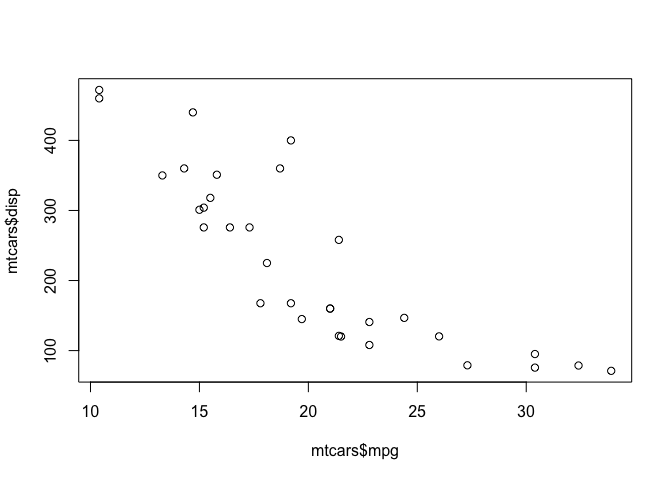
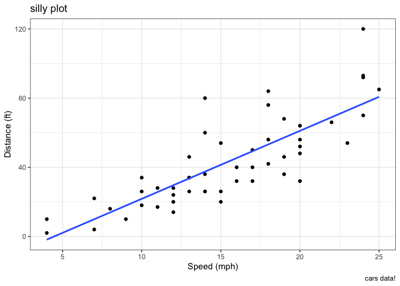
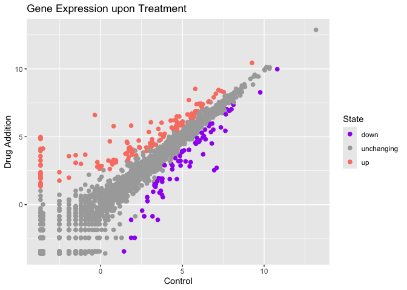
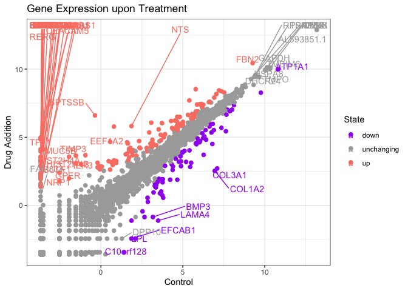
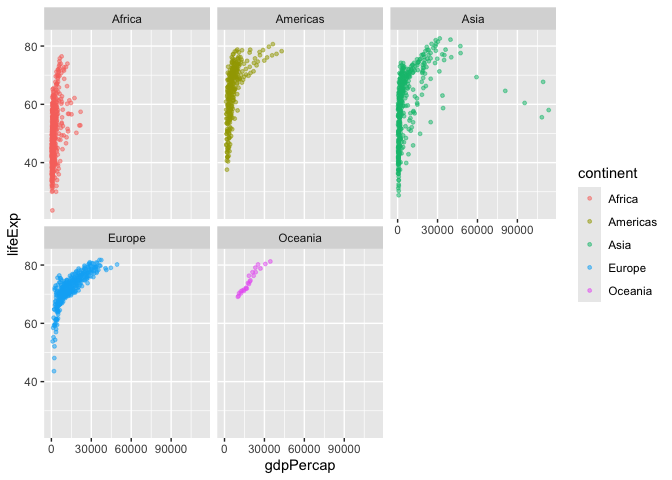
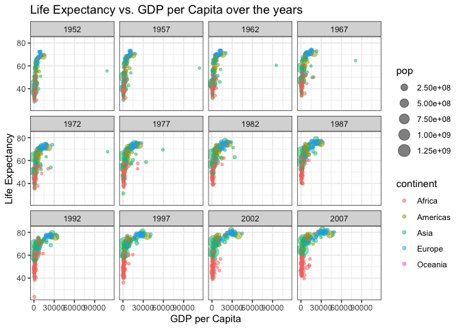

# class05
Meha Thakur (PID: A16020450)

## Quarto

Quarto enables you to weave together content and executable code into a
finished document. To learn more about Quarto see <https://quarto.org>.

## Running Code

When you click the **Render** button a document will be generated that
includes both content and the output of embedded code. You can embed
code like this:

Today we are playing with plotting and graphics in R- there are lots of
ways to make cool figures! Base R has graphics such as
(`plot()`,`hist()`, `boxplot()`, etc.)

loading packages required in this lab

``` r
#install.packages("ggplot2")
library(ggplot2)
library(ggrepel)
library(dplyr)
```


    Attaching package: 'dplyr'

    The following objects are masked from 'package:stats':

        filter, lag

    The following objects are masked from 'package:base':

        intersect, setdiff, setequal, union

Lets make a graph!

``` r
head(cars)
```

      speed dist
    1     4    2
    2     4   10
    3     7    4
    4     7   22
    5     8   16
    6     9   10

``` r
#using base R
plot(cars)
```


``` r
head(mtcars)
```

                       mpg cyl disp  hp drat    wt  qsec vs am gear carb
    Mazda RX4         21.0   6  160 110 3.90 2.620 16.46  0  1    4    4
    Mazda RX4 Wag     21.0   6  160 110 3.90 2.875 17.02  0  1    4    4
    Datsun 710        22.8   4  108  93 3.85 2.320 18.61  1  1    4    1
    Hornet 4 Drive    21.4   6  258 110 3.08 3.215 19.44  1  0    3    1
    Hornet Sportabout 18.7   8  360 175 3.15 3.440 17.02  0  0    3    2
    Valiant           18.1   6  225 105 2.76 3.460 20.22  1  0    3    1

lets plot mpg vs. disp

``` r
#baseR
plot(mtcars$mpg,mtcars$disp) 
```



``` r
hist(mtcars$mpg)
```


\##GGPLOT The main function in the ggplot2 package is the **ggplot()**.
The library is loaded above using `library()`. This package was
installed before. We never want to run `install.packages()` in a quarto
source doc as it will have to reinstall everytime you render.

``` r
ggplot(cars, aes(speed))+
  geom_histogram()
```

    `stat_bin()` using `bins = 30`. Pick better value `binwidth`.


Every ggplot needs at least 3 things:

- The **data** (given within the `gglot(cars)`)
- The **aes** mapping - how the columns of the data map to the plot
  (given with `aes()`)
- The **geom\_** (given by `geom_point()` as an example)

> For simple canned graphics, “base R” is nearly always quicker and
> faster. ggplot is much better for customising and tailoring for what
> you want. Your code is shorter in the long run.

## Adding more layers to our previous plot

``` r
ggplot(cars, aes(speed,dist))+
  geom_point()+
  geom_smooth(method="lm",se=F)+
  labs(title="silly plot",
       x="Speed (mph)",
       y="Distance (ft)",
       caption = "cars data!")+
  theme_bw()
```

    `geom_smooth()` using formula = 'y ~ x'



\##plotting expression dta

``` r
url <- "https://bioboot.github.io/bimm143_S20/class-material/up_down_expression.txt"
genes <- read.delim(url)
head(genes)
```

            Gene Condition1 Condition2      State
    1      A4GNT -3.6808610 -3.4401355 unchanging
    2       AAAS  4.5479580  4.3864126 unchanging
    3      AASDH  3.7190695  3.4787276 unchanging
    4       AATF  5.0784720  5.0151916 unchanging
    5       AATK  0.4711421  0.5598642 unchanging
    6 AB015752.4 -3.6808610 -3.5921390 unchanging

``` r
ncol(genes)
```

    [1] 4

``` r
table(genes$State)
```


          down unchanging         up 
            72       4997        127 

``` r
127/nrow(genes)
```

    [1] 0.02444188

``` r
##making the plot (condition 1= x condition 2= y)

ggplot(genes,aes(Condition1,Condition2, col = State))+
  geom_point(size=2)+
  scale_color_manual(values=c("purple","darkgrey","salmon"))+
  labs(title = "Gene Expression upon Treatment",
       x = "Control",
       y = "Drug Addition")
```



``` r
#if i want to add labels (this will be messy)
ggplot(genes,aes(Condition1,Condition2, col = State,label=Gene))+
  geom_point(size=2)+
  scale_color_manual(values=c("purple","darkgrey","salmon"))+
  labs(title = "Gene Expression upon Treatment",
       x = "Control",
       y = "Drug Addition")+
  geom_text_repel(max.overlaps=100)+
  theme_bw()
```

    Warning: ggrepel: 5140 unlabeled data points (too many overlaps). Consider
    increasing max.overlaps



> Q1. How many genes are there?

There are 5196 in this dataset

> Q2. How many upregulated genes are there

``` r
sum(genes$State == "up")
```

    [1] 127

``` r
table(genes$State)
```


          down unchanging         up 
            72       4997        127 

\##USING GAPMINDER DATASET

``` r
url <- "https://raw.githubusercontent.com/jennybc/gapminder/master/inst/extdata/gapminder.tsv"

gapminder <- read.delim(url)

head(gapminder)
```

          country continent year lifeExp      pop gdpPercap
    1 Afghanistan      Asia 1952  28.801  8425333  779.4453
    2 Afghanistan      Asia 1957  30.332  9240934  820.8530
    3 Afghanistan      Asia 1962  31.997 10267083  853.1007
    4 Afghanistan      Asia 1967  34.020 11537966  836.1971
    5 Afghanistan      Asia 1972  36.088 13079460  739.9811
    6 Afghanistan      Asia 1977  38.438 14880372  786.1134

``` r
tail(gapminder)
```

          country continent year lifeExp      pop gdpPercap
    1699 Zimbabwe    Africa 1982  60.363  7636524  788.8550
    1700 Zimbabwe    Africa 1987  62.351  9216418  706.1573
    1701 Zimbabwe    Africa 1992  60.377 10704340  693.4208
    1702 Zimbabwe    Africa 1997  46.809 11404948  792.4500
    1703 Zimbabwe    Africa 2002  39.989 11926563  672.0386
    1704 Zimbabwe    Africa 2007  43.487 12311143  469.7093

``` r
#make plot of year (x) and GDP (y), divided by continent
ggplot(gapminder, aes(gdpPercap, lifeExp,color=continent))+
  geom_point(size=1,alpha=0.5)+
  facet_wrap(~continent)
```



\##exploring this data set on my own

``` r
head(gapminder)
```

          country continent year lifeExp      pop gdpPercap
    1 Afghanistan      Asia 1952  28.801  8425333  779.4453
    2 Afghanistan      Asia 1957  30.332  9240934  820.8530
    3 Afghanistan      Asia 1962  31.997 10267083  853.1007
    4 Afghanistan      Asia 1967  34.020 11537966  836.1971
    5 Afghanistan      Asia 1972  36.088 13079460  739.9811
    6 Afghanistan      Asia 1977  38.438 14880372  786.1134

``` r
#plotting how life expectancy changes  as gdp per capita changes, divided by year, colored according to continent, and sized according to population.

ggplot(gapminder, aes(gdpPercap, lifeExp, color=continent, size=pop))+
  geom_point(alpha=0.5)+
  theme_bw()+
  labs(title="Life Expectancy vs. GDP per Capita over the years",
       x = "GDP per Capita",
       y = "Life Expectancy")+
  facet_wrap(~year)
```



``` r
##add more graphs before submitting
```
