# lab7: Machine Learning 1
Meha Thakur PID A16020450

- [K-means clustering](#k-means-clustering)
- [Hierarchiacal clustering\*](#hierarchiacal-clustering)
- [Principal component analysis (PCA) using UK
  FOODS](#principal-component-analysis-pca-using-uk-foods)

Today we will begin our exploration of some classical machine learning
techniques/approaches in R. We will start with clustering!

## K-means clustering

Conceptually straightforward, input your data, tell them you want ‘k’
clusters, and it will give you that. Uses euclidian distances to some
centroid. Iterates until it finds a good answer.

Make up some data to cluster

``` r
hist(rnorm(1000)) #1000 numbers with mean 0 (default), normal distribution. Draw a histogram to visualize this
```


``` r
#want 30 points centered +3 to -3
rnorm(30,-3) #30 points, mean -3
```

     [1] -1.9354027 -2.5943380 -2.9063548 -3.0511670 -3.7478212 -4.2227771
     [7] -5.0038273 -3.3442295 -3.9092337 -2.4911280 -2.9600380 -2.8761646
    [13] -2.6467307 -4.5370098 -1.6843610 -2.2322718 -2.1179820 -2.3858418
    [19] -2.7750992 -2.9276316 -2.1508657 -3.7243057 -2.8856687 -2.9766671
    [25] -3.9869778 -5.0765414 -3.9613180 -3.3116148 -3.3661278 -0.5316348

``` r
rnorm(30,3) #30 points, mean +3
```

     [1] 3.274493 1.458095 3.926777 2.573650 3.587913 2.640480 2.168335 3.654817
     [9] 2.341437 2.583720 2.735268 1.701388 3.186050 5.922863 2.722912 4.121813
    [17] 3.606966 3.620085 1.791655 2.379438 3.822995 2.759277 3.477134 2.460053
    [25] 3.976068 3.361016 5.120639 1.907284 5.031048 2.867411

``` r
x<-c(rnorm(30,-3),rnorm(30,3)) #60 points 
y<- rev(x) #reverse of x

x<- cbind(x,y) #column-bound data 

plot(x) #visualise our data
```

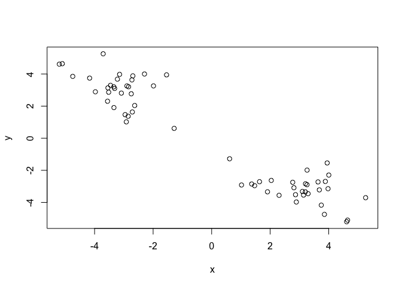

The main function in “base R” for k-means clustering is `kmeans()`. Has
2 required arguments - data, centers.

``` r
k<-kmeans(x, centers=2) #in our initial plot looks like there should be 2 centers
```

> Q. how big are the clusters

``` r
k$size
```

    [1] 30 30

> Q. What clusters do my data points reside in?

``` r
k$cluster
```

     [1] 2 2 2 2 2 2 2 2 2 2 2 2 2 2 2 2 2 2 2 2 2 2 2 2 2 2 2 2 2 2 1 1 1 1 1 1 1 1
    [39] 1 1 1 1 1 1 1 1 1 1 1 1 1 1 1 1 1 1 1 1 1 1

> Q. make a plot of our data coloured by cluster assignment (a result
> figure)

``` r
#library(ggplot2)

plot(x, col=k[["cluster"]]) #plot and colour by cluster
points(k$centers,col="blue",pch=15) #plot the center as a square
```


> Q. ask for 4 centers this time

``` r
four<- kmeans(x, centers=4) 

plot(x,col=four[["cluster"]])
points(four$centers,col="blue",pch=15) #plot the center as a square
```

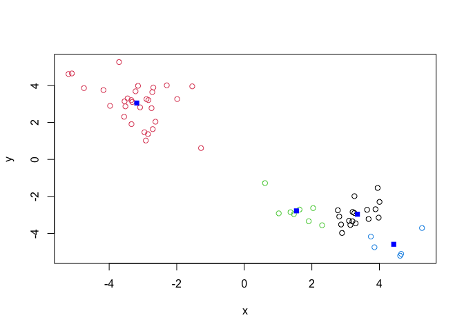

> Q. run Kmeans with centers (i.e. values of k) equal 1-6. I want to
> store tot.withinss (metric for how good the clustering is) for each
> value

``` r
ss<-c() #initialise tot.withinss vector before we fill it in the loop

for(i in 1:6){

  
  k_x<-kmeans(x,i)
  k_plot<-plot(x,col=k_x[["cluster"]])
  points(k_x$centers,col="blue",pch=15)
  
  ss[i]<- k_x$tot.withinss

}
```

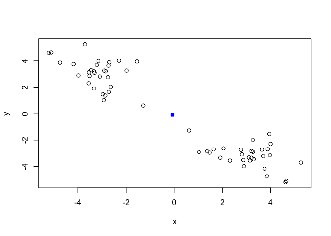

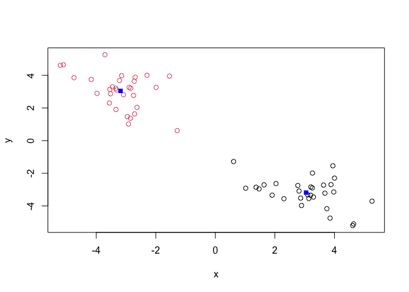

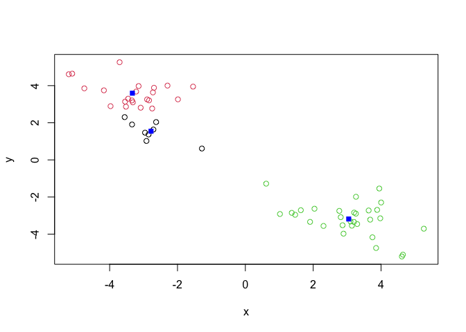

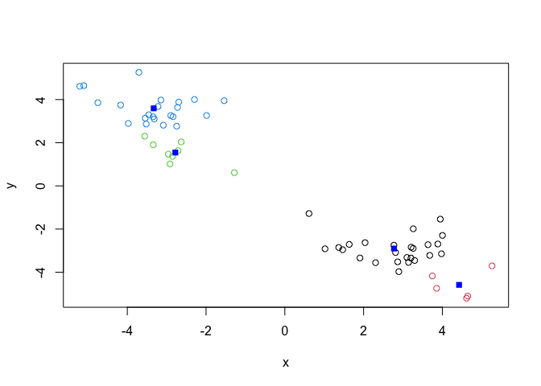


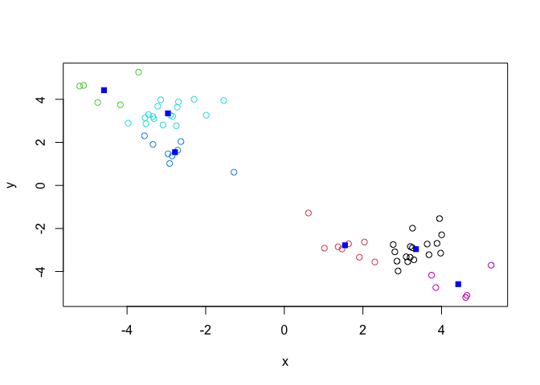

``` r
  plot(ss,type="b") #tot.withinss plot 
```

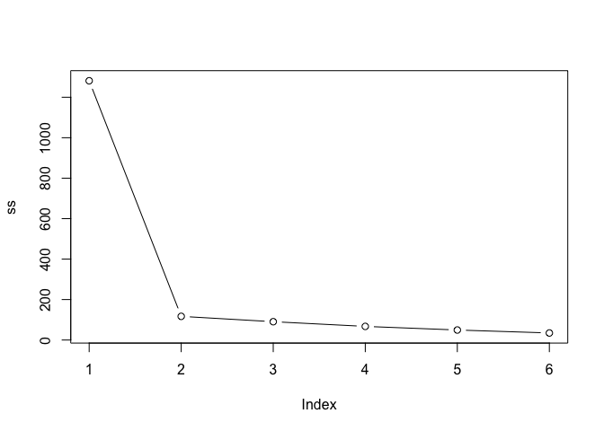

## Hierarchiacal clustering\*

The main function in “base R” for this is called `hclust()`

``` r
d<-dist(x) #gives individual distances between all data points
hc<-hclust(d)
hc
```


    Call:
    hclust(d = d)

    Cluster method   : complete 
    Distance         : euclidean 
    Number of objects: 60 

``` r
plot(hc) #gives us a clustering tree (dendrogram)
abline(h=7, col="red") 
```

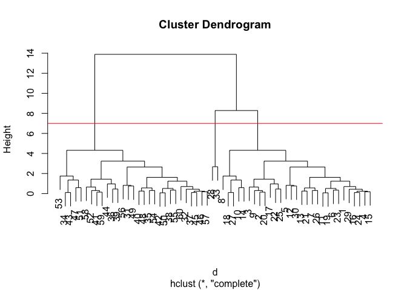

To obtain clusters from our `hclust()` object, the result object *hc* we
“cut” the tree to yield different sub-branches. For this we use the
`cutree()` function.

``` r
grps<-cutree(hc,h=7) #can specify height (cuts our tree at a certain height), this returns a clustering vector
grps
```

     [1] 1 1 1 1 1 1 1 1 1 1 1 1 1 1 1 1 1 1 1 1 1 1 1 1 1 1 1 2 1 1 3 3 2 3 3 3 3 3
    [39] 3 3 3 3 3 3 3 3 3 3 3 3 3 3 3 3 3 3 3 3 3 3

``` r
plot(x,col=grps)
```

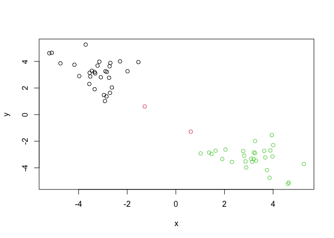

``` r
#install.packages("pheatmap")
library(pheatmap)

pheatmap(x) #does the clustering for you
```

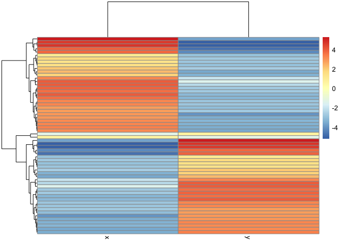

## Principal component analysis (PCA) using UK FOODS

This technique projects features on to principal components. Aim is to
reduces dimensionality while only losing a small amount of information.
PCs are just low dimensional axes closest to the dimensions. Condensing
all your variables (dimensions) into 2. We plot PC1 vs. PC2. PC1
captures most of the componenets, PC2 usually captures the rest. We will
also get subseqeunt PCs but most of our data should be captured in PC1
and 2. Data is usually more spread along PC1 than PC2.

``` r
#loading in data
data<-read.csv("UK_foods.csv")

#can also read directly from website:
#url <- "https://tinyurl.com/UK-foods"
#x <- read.csv(url)
```

> Q1. How many rows and columns are in your new data frame named x? What
> R functions could you use to answer this questions?

``` r
dim(data)
```

    [1] 17  5

``` r
nrow(data)
```

    [1] 17

``` r
ncol(data)
```

    [1] 5

There are 17 rows, 5 columns.

``` r
#preview first 6 rows
head(data)
```

                   X England Wales Scotland N.Ireland
    1         Cheese     105   103      103        66
    2  Carcass_meat      245   227      242       267
    3    Other_meat      685   803      750       586
    4           Fish     147   160      122        93
    5 Fats_and_oils      193   235      184       209
    6         Sugars     156   175      147       139

fix rownames so the first column is no longer considered a data column

``` r
rownames(data) <- data[,1] #assign the first column as rownames that you will add to the df
data <- data[,-1] #remove the first column of data (repeat of rownames)
head(data) #preview
```

                   England Wales Scotland N.Ireland
    Cheese             105   103      103        66
    Carcass_meat       245   227      242       267
    Other_meat         685   803      750       586
    Fish               147   160      122        93
    Fats_and_oils      193   235      184       209
    Sugars             156   175      147       139

check dimensions again

``` r
dim(data)
```

    [1] 17  4

We could have also loaded in the data specifying the first column is
rownames

``` r
data <- read.csv("UK_foods.csv", row.names=1)
head(data)
```

                   England Wales Scotland N.Ireland
    Cheese             105   103      103        66
    Carcass_meat       245   227      242       267
    Other_meat         685   803      750       586
    Fish               147   160      122        93
    Fats_and_oils      193   235      184       209
    Sugars             156   175      147       139

> Q2. Which approach to solving the ‘row-names problem’ mentioned above
> do you prefer and why? Is one approach more robust than another under
> certain circumstances?

I would prefer to use a direct call when I read in the file, specifying
row.names=1. This minimizes chance of error and makes sure you aren’t
saving a version of the data that has duplicated values. For a very
large data set that takes a while to load in, it may also take some time
to run code to manipulate the data later to change rownames, remove a
column etc.

> Q3: Changing what optional argument in the above barplot() function
> results in the following plot?

Change the beside argument to false.

``` r
# Using base R - starting plot
barplot(as.matrix(data), beside=T, col=rainbow(nrow(data)))
```


``` r
barplot(as.matrix(data), beside=F, col=rainbow(nrow(data))) 
```


Use ggplot - need to convert to long format

``` r
library(tidyr)
library(ggplot2)
dim(data) #wide format
```

    [1] 17  4

``` r
data_long<-data|>
  tibble::rownames_to_column("Food")|>
  pivot_longer(cols=-Food,
               names_to="Country",
               values_to="Consumption")
```

> Q4: Changing what optional argument in the above ggplot() code results
> in a stacked barplot figure? dodge–\> stack

``` r
#sample ggplot code
ggplot(data_long) +
  aes(x = Country, y = Consumption, fill = Food) +
  geom_col(position = "dodge") +
  theme_bw()
```


``` r
#changed code
ggplot(data_long) +
  aes(x = Country, y = Consumption, fill = Food) +
  geom_col(position = "stack") +
  theme_bw()
```


> Q5: We can use the pairs() function to generate all pairwise plots for
> our countries. Can you make sense of the following code and resulting
> figure? What does it mean if a given point lies on the diagonal for a
> given plot? this plot allows you to see how each country’s food
> correlates with another. For example, the plot immediately to the
> right of the England square, we can see how the diet of England
> matches up to the diet of Wales. So we can see how countries match up
> pairwise. Along the diagonal, it would be a self-match (eg. England
> vs. England).

``` r
pairs(data, col=rainbow(nrow(x)), pch=16)
```

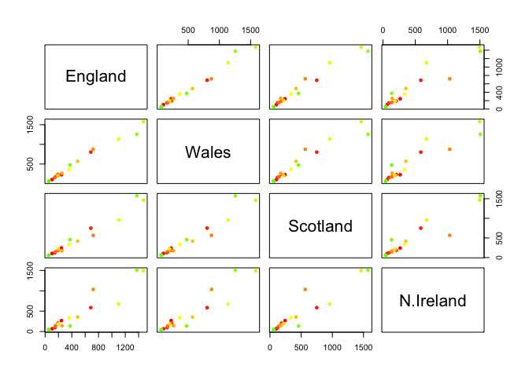

The pairs approach only works with smaller data sets. With larger ones,
we would want to use a heatmap.

``` r
library(pheatmap)

pheatmap( as.matrix(data) )
```


> Q6. Based on the pairs and heatmap figures, which countries cluster
> together and what does this suggest about their food consumption
> patterns? Can you easily tell what the main differences between N.
> Ireland and the other countries of the UK in terms of this data-set?
> It looks like Wales and England cluster together quite easily, seen by
> similar heatmap profile and pairwise correlation. Wales and N. Ireland
> differ the most, seen by their distance on the heatmap.

This will be easier using PCA \>Q7. Complete the code below to generate
a plot of PC1 vs PC2. The second line adds text labels over the data
points.

The main function we use in “base R” for PCA is called `prcomp()`. We
want data organised differently, as foods will need to be in the
columns. So we take a transpose.

``` r
pca<-prcomp(t(data))
summary(pca)
```

    Importance of components:
                                PC1      PC2      PC3       PC4
    Standard deviation     324.1502 212.7478 73.87622 4.189e-14
    Proportion of Variance   0.6744   0.2905  0.03503 0.000e+00
    Cumulative Proportion    0.6744   0.9650  1.00000 1.000e+00

Our result object is called `pca` - this is a list object. To get the
components of the output, we use`$x`

``` r
pca$x #shows us where these countries lie on our new axis
```

                     PC1         PC2         PC3           PC4
    England   -144.99315    2.532999 -105.768945  2.842865e-14
    Wales     -240.52915  224.646925   56.475555  7.804382e-13
    Scotland   -91.86934 -286.081786   44.415495 -9.614462e-13
    N.Ireland  477.39164   58.901862    4.877895  1.448078e-13

``` r
cols<-c("orange","red","blue","green")
ggplot(pca$x,aes(x=PC1,y=PC2,label=rownames(pca$x)))+
  geom_point(col=cols, size=10)+ #increase size of points to see them better
  theme_bw()+
  geom_text()
```

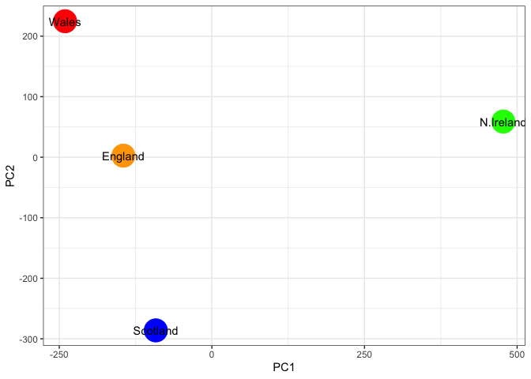

Another major result out of PCA is the so-called “variable loadings” or
`$rotation`. This tells us how the original variables (in our case
foods) contribute to the new axis.

``` r
pca$rotation
```

                                 PC1          PC2         PC3          PC4
    Cheese              -0.056955380 -0.016012850 -0.02394295 -0.691718038
    Carcass_meat         0.047927628 -0.013915823 -0.06367111  0.635384915
    Other_meat          -0.258916658  0.015331138  0.55384854  0.198175921
    Fish                -0.084414983  0.050754947 -0.03906481 -0.015824630
    Fats_and_oils       -0.005193623  0.095388656  0.12522257  0.052347444
    Sugars              -0.037620983  0.043021699  0.03605745  0.014481347
    Fresh_potatoes       0.401402060  0.715017078  0.20668248 -0.151706089
    Fresh_Veg           -0.151849942  0.144900268 -0.21382237  0.056182433
    Other_Veg           -0.243593729  0.225450923  0.05332841 -0.080722623
    Processed_potatoes  -0.026886233 -0.042850761  0.07364902 -0.022618707
    Processed_Veg       -0.036488269  0.045451802 -0.05289191  0.009235001
    Fresh_fruit         -0.632640898  0.177740743 -0.40012865 -0.021899087
    Cereals             -0.047702858  0.212599678  0.35884921  0.084667257
    Beverages           -0.026187756  0.030560542  0.04135860 -0.011880823
    Soft_drinks          0.232244140 -0.555124311  0.16942648 -0.144367046
    Alcoholic_drinks    -0.463968168 -0.113536523  0.49858320 -0.115797605
    Confectionery       -0.029650201 -0.005949921  0.05232164 -0.003695024

``` r
ggplot(pca$rotation,aes(PC1,rownames(pca$rotation)))+
  geom_col()
```


