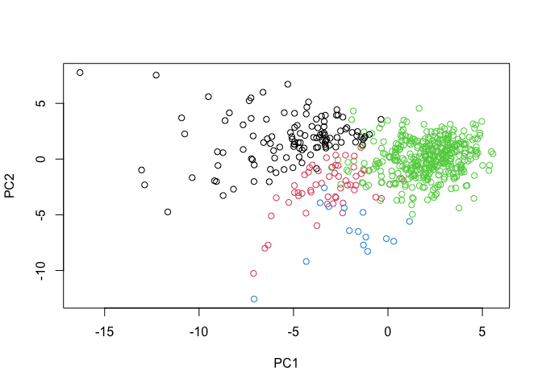

# lab8-miniproject
Meha Thakur (PID A16020450)

- [Loading Packages](#loading-packages)
- [Data Import](#data-import)
- [2.Principal component analysis
  (PCA)](#2principal-component-analysis-pca)
- [Variance Explained](#variance-explained)
- [Hierarchical Clustering](#hierarchical-clustering)
- [Specificity vs. Sensitivity](#specificity-vs-sensitivity)

## Loading Packages

``` r
library(ggplot2)
library(dplyr)
```


    Attaching package: 'dplyr'

    The following objects are masked from 'package:stats':

        filter, lag

    The following objects are masked from 'package:base':

        intersect, setdiff, setequal, union

## Data Import

``` r
# Save your input data file into your Project directory
fna.data <- "WisconsinCancer.csv"
# Complete the following code to input the data and store as wisc.df
wisc.df <- read.csv(fna.data, row.names=1)


# We can use -1 here to remove the first column
wisc.data <- wisc.df[,-1]
head(wisc.data)
```

             radius_mean texture_mean perimeter_mean area_mean smoothness_mean
    842302         17.99        10.38         122.80    1001.0         0.11840
    842517         20.57        17.77         132.90    1326.0         0.08474
    84300903       19.69        21.25         130.00    1203.0         0.10960
    84348301       11.42        20.38          77.58     386.1         0.14250
    84358402       20.29        14.34         135.10    1297.0         0.10030
    843786         12.45        15.70          82.57     477.1         0.12780
             compactness_mean concavity_mean concave.points_mean symmetry_mean
    842302            0.27760         0.3001             0.14710        0.2419
    842517            0.07864         0.0869             0.07017        0.1812
    84300903          0.15990         0.1974             0.12790        0.2069
    84348301          0.28390         0.2414             0.10520        0.2597
    84358402          0.13280         0.1980             0.10430        0.1809
    843786            0.17000         0.1578             0.08089        0.2087
             fractal_dimension_mean radius_se texture_se perimeter_se area_se
    842302                  0.07871    1.0950     0.9053        8.589  153.40
    842517                  0.05667    0.5435     0.7339        3.398   74.08
    84300903                0.05999    0.7456     0.7869        4.585   94.03
    84348301                0.09744    0.4956     1.1560        3.445   27.23
    84358402                0.05883    0.7572     0.7813        5.438   94.44
    843786                  0.07613    0.3345     0.8902        2.217   27.19
             smoothness_se compactness_se concavity_se concave.points_se
    842302        0.006399        0.04904      0.05373           0.01587
    842517        0.005225        0.01308      0.01860           0.01340
    84300903      0.006150        0.04006      0.03832           0.02058
    84348301      0.009110        0.07458      0.05661           0.01867
    84358402      0.011490        0.02461      0.05688           0.01885
    843786        0.007510        0.03345      0.03672           0.01137
             symmetry_se fractal_dimension_se radius_worst texture_worst
    842302       0.03003             0.006193        25.38         17.33
    842517       0.01389             0.003532        24.99         23.41
    84300903     0.02250             0.004571        23.57         25.53
    84348301     0.05963             0.009208        14.91         26.50
    84358402     0.01756             0.005115        22.54         16.67
    843786       0.02165             0.005082        15.47         23.75
             perimeter_worst area_worst smoothness_worst compactness_worst
    842302            184.60     2019.0           0.1622            0.6656
    842517            158.80     1956.0           0.1238            0.1866
    84300903          152.50     1709.0           0.1444            0.4245
    84348301           98.87      567.7           0.2098            0.8663
    84358402          152.20     1575.0           0.1374            0.2050
    843786            103.40      741.6           0.1791            0.5249
             concavity_worst concave.points_worst symmetry_worst
    842302            0.7119               0.2654         0.4601
    842517            0.2416               0.1860         0.2750
    84300903          0.4504               0.2430         0.3613
    84348301          0.6869               0.2575         0.6638
    84358402          0.4000               0.1625         0.2364
    843786            0.5355               0.1741         0.3985
             fractal_dimension_worst
    842302                   0.11890
    842517                   0.08902
    84300903                 0.08758
    84348301                 0.17300
    84358402                 0.07678
    843786                   0.12440

``` r
# Create diagnosis vector for later -saved as a factor
diagnosis <- factor(wisc.df$diagnosis)
```

> Q1. How many observations are in this dataset?

``` r
nrow(wisc.data)
```

    [1] 569

ans:569

> Q2. How many of the observations have a malignant diagnosis?

``` r
sum(wisc.df$diagnosis=="M")
```

    [1] 212

ans: there are 212 malignant observations

> Q3. How many variables/features in the data are suffixed with \_mean?

``` r
sum(grepl("_mean$", names(wisc.df)))
```

    [1] 10

There are 10 variables with the suffix \_mean

## 2.Principal component analysis (PCA)

``` r
# Check column means and standard deviations
colMeans(wisc.data)
```

                radius_mean            texture_mean          perimeter_mean 
               1.412729e+01            1.928965e+01            9.196903e+01 
                  area_mean         smoothness_mean        compactness_mean 
               6.548891e+02            9.636028e-02            1.043410e-01 
             concavity_mean     concave.points_mean           symmetry_mean 
               8.879932e-02            4.891915e-02            1.811619e-01 
     fractal_dimension_mean               radius_se              texture_se 
               6.279761e-02            4.051721e-01            1.216853e+00 
               perimeter_se                 area_se           smoothness_se 
               2.866059e+00            4.033708e+01            7.040979e-03 
             compactness_se            concavity_se       concave.points_se 
               2.547814e-02            3.189372e-02            1.179614e-02 
                symmetry_se    fractal_dimension_se            radius_worst 
               2.054230e-02            3.794904e-03            1.626919e+01 
              texture_worst         perimeter_worst              area_worst 
               2.567722e+01            1.072612e+02            8.805831e+02 
           smoothness_worst       compactness_worst         concavity_worst 
               1.323686e-01            2.542650e-01            2.721885e-01 
       concave.points_worst          symmetry_worst fractal_dimension_worst 
               1.146062e-01            2.900756e-01            8.394582e-02 

``` r
apply(wisc.data,2,sd)
```

                radius_mean            texture_mean          perimeter_mean 
               3.524049e+00            4.301036e+00            2.429898e+01 
                  area_mean         smoothness_mean        compactness_mean 
               3.519141e+02            1.406413e-02            5.281276e-02 
             concavity_mean     concave.points_mean           symmetry_mean 
               7.971981e-02            3.880284e-02            2.741428e-02 
     fractal_dimension_mean               radius_se              texture_se 
               7.060363e-03            2.773127e-01            5.516484e-01 
               perimeter_se                 area_se           smoothness_se 
               2.021855e+00            4.549101e+01            3.002518e-03 
             compactness_se            concavity_se       concave.points_se 
               1.790818e-02            3.018606e-02            6.170285e-03 
                symmetry_se    fractal_dimension_se            radius_worst 
               8.266372e-03            2.646071e-03            4.833242e+00 
              texture_worst         perimeter_worst              area_worst 
               6.146258e+00            3.360254e+01            5.693570e+02 
           smoothness_worst       compactness_worst         concavity_worst 
               2.283243e-02            1.573365e-01            2.086243e-01 
       concave.points_worst          symmetry_worst fractal_dimension_worst 
               6.573234e-02            6.186747e-02            1.806127e-02 

``` r
# Perform PCA on wisc.data by completing the following code
wisc.pr <- prcomp(wisc.data, scale=T) #scale=T makes sure values are normalised
summary(wisc.pr)
```

    Importance of components:
                              PC1    PC2     PC3     PC4     PC5     PC6     PC7
    Standard deviation     3.6444 2.3857 1.67867 1.40735 1.28403 1.09880 0.82172
    Proportion of Variance 0.4427 0.1897 0.09393 0.06602 0.05496 0.04025 0.02251
    Cumulative Proportion  0.4427 0.6324 0.72636 0.79239 0.84734 0.88759 0.91010
                               PC8    PC9    PC10   PC11    PC12    PC13    PC14
    Standard deviation     0.69037 0.6457 0.59219 0.5421 0.51104 0.49128 0.39624
    Proportion of Variance 0.01589 0.0139 0.01169 0.0098 0.00871 0.00805 0.00523
    Cumulative Proportion  0.92598 0.9399 0.95157 0.9614 0.97007 0.97812 0.98335
                              PC15    PC16    PC17    PC18    PC19    PC20   PC21
    Standard deviation     0.30681 0.28260 0.24372 0.22939 0.22244 0.17652 0.1731
    Proportion of Variance 0.00314 0.00266 0.00198 0.00175 0.00165 0.00104 0.0010
    Cumulative Proportion  0.98649 0.98915 0.99113 0.99288 0.99453 0.99557 0.9966
                              PC22    PC23   PC24    PC25    PC26    PC27    PC28
    Standard deviation     0.16565 0.15602 0.1344 0.12442 0.09043 0.08307 0.03987
    Proportion of Variance 0.00091 0.00081 0.0006 0.00052 0.00027 0.00023 0.00005
    Cumulative Proportion  0.99749 0.99830 0.9989 0.99942 0.99969 0.99992 0.99997
                              PC29    PC30
    Standard deviation     0.02736 0.01153
    Proportion of Variance 0.00002 0.00000
    Cumulative Proportion  1.00000 1.00000

> Q4. From your results, what proportion of the original variance is
> captured by the first principal components (PC1)?

ans: 0.4427

> Q5. How many principal components (PCs) are required to describe at
> least 70% of the original variance in the data?

``` r
var_wisc<-wisc.pr[["sdev"]]^2
var_prop<-var_wisc/sum(var_wisc)

cumulative_var<-cumsum(var_prop)
which(cumulative_var>=0.7) [1]
```

    [1] 3

ans: 3 components

> Q6. How many principal components (PCs) are required to describe at
> least 90% of the original variance in the data?

``` r
which(cumulative_var>=0.9) [1]
```

    [1] 7

ans: 7 PCs

result figure pc plot, or score plot

``` r
ggplot(wisc.pr$x, aes(PC1,PC2,col=diagnosis))+
    geom_point()
```


> Q7. What stands out to you about this plot? Is it easy or difficult to
> understand? Why?

The benign and malignant groups are more or less separate from each
other - so they have different clusters. This is relatively easy to
understand as the colours make it easy to differentiate different
groups.

> Q8. Generate a similar plot for principal components 1 and 3. What do
> you notice about these plots?

``` r
ggplot(wisc.pr$x, aes(PC1,PC3,col=diagnosis))+
    geom_point()
```


There appears to be more overlap between B and M groups when plotting
PC1 and PC3, so they don’t cluster as distinctly.

## Variance Explained

``` r
# Calculate variance of each component
pr.var <- wisc.pr[["sdev"]]^2
head(pr.var)
```

    [1] 13.281608  5.691355  2.817949  1.980640  1.648731  1.207357

``` r
# Variance explained by each principal component: pve
pve <- pr.var / sum(pr.var)

# Plot variance explained for each principal component
plot(pve, xlab = "Principal Component", 
     ylab = "Proportion of Variance Explained", 
     ylim = c(0, 1), type = "o")
```


``` r
# Alternative scree plot of the same data, note data driven y-axis
barplot(pve, ylab = "Precent of Variance Explained",
     names.arg=paste0("PC",1:length(pve)), las=2, axes = FALSE)
axis(2, at=pve, labels=round(pve,2)*100 )
```


``` r
## ggplot based graph
#install.packages("factoextra")
#install.packages("ggpubr")
#library(factoextra)
#library(ggpubr)

#fviz_eig(wisc.pr, addlabels = TRUE)

#had problems downloading the package
```

> Q9. For the first principal component, what is the component of the
> loading vector (i.e. wisc.pr\$rotation\[,1\]) for the feature
> concave.points_mean? This tells us how much this original feature
> contributes to the first PC.

``` r
wisc.pr$rotation[,1]
```

                radius_mean            texture_mean          perimeter_mean 
                -0.21890244             -0.10372458             -0.22753729 
                  area_mean         smoothness_mean        compactness_mean 
                -0.22099499             -0.14258969             -0.23928535 
             concavity_mean     concave.points_mean           symmetry_mean 
                -0.25840048             -0.26085376             -0.13816696 
     fractal_dimension_mean               radius_se              texture_se 
                -0.06436335             -0.20597878             -0.01742803 
               perimeter_se                 area_se           smoothness_se 
                -0.21132592             -0.20286964             -0.01453145 
             compactness_se            concavity_se       concave.points_se 
                -0.17039345             -0.15358979             -0.18341740 
                symmetry_se    fractal_dimension_se            radius_worst 
                -0.04249842             -0.10256832             -0.22799663 
              texture_worst         perimeter_worst              area_worst 
                -0.10446933             -0.23663968             -0.22487053 
           smoothness_worst       compactness_worst         concavity_worst 
                -0.12795256             -0.21009588             -0.22876753 
       concave.points_worst          symmetry_worst fractal_dimension_worst 
                -0.25088597             -0.12290456             -0.13178394 

## Hierarchical Clustering

``` r
# Scale the wisc.data data using the "scale()" function
data.scaled <- scale(wisc.data)
data.dist <- dist(data.scaled)
```

> Q10. Using the plot() and abline() functions, what is the height at
> which the clustering model has 4 clusters.

h=19 gives us 4 clusters.

``` r
wisc.hclust <- hclust(data.dist, "complete")

plot(wisc.hclust)
abline(h=19, col="red", lty=2)
```


``` r
wisc.hclust.clusters <- cutree(wisc.hclust,h=19)
table(wisc.hclust.clusters, diagnosis)
```

                        diagnosis
    wisc.hclust.clusters   B   M
                       1  12 165
                       2   2   5
                       3 343  40
                       4   0   2

> Q11. OPTIONAL: Can you find a better cluster vs diagnoses match by
> cutting into a different number of clusters between 2 and 10? How do
> you judge the quality of your result in each case?

> Q12. Which method gives your favorite results for the same data.dist
> dataset? Explain your reasoning.

ward.D2 is my favourite, as it has the most distinct and even looking
clusters. The other methods are less balanced, starting all the way on
one side and dividing from there. Because of this they are more crowded
and it is much more difficult to visualise each cluster.

``` r
wisc.pr.hclust2 <- hclust(data.dist, "ward.D2")
plot(wisc.pr.hclust2)
```


``` r
wisc.pr.single<-hclust(data.dist,method="single")
plot(wisc.pr.single)
```


``` r
wisc.pr.ave<-hclust(data.dist,method="average")
plot(wisc.pr.ave)
```


Combining techniques

> Q13. How well does the newly created model with four clusters separate
> out the two diagnoses?

There are some weak clusters when comparing 4 vs. 2. However, it doesn’t
become more distinct. The actual data points remain very similar,
however the groups have just become more specifically defined. So
although there are more clusters in the 4 cluster graph, the actual
diagnosis points cluster the same.

``` r
#2 clusters using ward method
grps <- cutree(wisc.pr.hclust2, h=70)
table(grps)
```

    grps
      1   2 
    184 385 

``` r
table(grps, diagnosis)
```

        diagnosis
    grps   B   M
       1  20 164
       2 337  48

``` r
plot(wisc.pr$x[,1:2], col=grps)
```


``` r
plot(wisc.pr$x[,1:2], col=diagnosis)
```


``` r
# clusters
grps1 <- cutree(wisc.pr.hclust2, h=32)
table(grps1)
```

    grps1
      1   2   3   4 
    115  54 385  15 

``` r
table(grps1, diagnosis)
```

         diagnosis
    grps1   B   M
        1   0 115
        2   6  48
        3 337  48
        4  14   1

``` r
plot(wisc.pr$x[,1:2], col=grps1) #colors indicate 4 groups
```



``` r
plot(wisc.pr$x[,1:2], col=diagnosis) #2 diagnosis colours
```


``` r
## Use the distance along the first 7 PCs for clustering i.e. wisc.pr$x[, 1:7]

wisc.pr.hclust <- hclust(dist(wisc.pr$x[, 1:7]), method="ward.D2")
plot(wisc.pr.hclust)
```


``` r
wisc.pr.hclust.clusters <- cutree(wisc.pr.hclust, h=70)
table(wisc.pr.hclust.clusters,diagnosis)
```

                           diagnosis
    wisc.pr.hclust.clusters   B   M
                          1  28 188
                          2 329  24

> Q.13 How well does the newly created model with four clusters separate
> out the two diagnoses?

My model uses 2 clusters, and it appears to seperate out the clusters
quite well. The earlier model with 4 clusters (wisc.hclust.clusters) I
used appears to separate out diagnoses differently - this makes sense as
it is clustering into 4 groups rather than 2. That being said, I cannot
say which is objectively better.

> Q14. How well do the hierarchical clustering models you created in
> previous sections (i.e. before PCA) do in terms of separating the
> diagnoses? Again, use the table() function to compare the output of
> each model (wisc.km\$cluster and wisc.hclust.clusters) with the vector
> containing the actual diagnoses.

The hierarchical clustering models appear to seperate out diagnoses, as
seen by the table() function. From the dendrogram, however, it is
difficult ot visualise how distinct these clusters are as we would be
able to see in a PCA plot.

``` r
table(wisc.hclust.clusters, diagnosis)
```

                        diagnosis
    wisc.hclust.clusters   B   M
                       1  12 165
                       2   2   5
                       3 343  40
                       4   0   2

## Specificity vs. Sensitivity

> Q15. OPTIONAL: Which of your analysis procedures resulted in a
> clustering model with the best specificity? How about sensitivity?

Sensitivity = TP/(TP+FN)

``` r
#clustering model before PCA
table(wisc.hclust.clusters, diagnosis) #outputs
```

                        diagnosis
    wisc.hclust.clusters   B   M
                       1  12 165
                       2   2   5
                       3 343  40
                       4   0   2

Sensitivity (mostly malignant) : True positive (TP) = 165 (malignant),
False Negative (FN) = 12+2+0=14. False positives (FP)=40+5+2=47

``` r
#sensitivity
165/(165+14)
```

    [1] 0.9217877

For negatives (benign:) TN/(TN+FN) Specificity Cluster 3 (mostly
benign): TN=343, FN = 12+2+0=14

``` r
#specificity
343/(343+14)
```

    [1] 0.9607843

Clustering after PCA - combined method

``` r
table(wisc.pr.hclust.clusters, diagnosis)
```

                           diagnosis
    wisc.pr.hclust.clusters   B   M
                          1  28 188
                          2 329  24

Sensitivity: TP=188, FN=28

``` r
188/(188+28)
```

    [1] 0.8703704

Specificity: TN=329, FN=28

``` r
329/(329+28)
```

    [1] 0.9215686

Clustering before PCA provides higher specificity and higher sensitivity
than the combined method.
